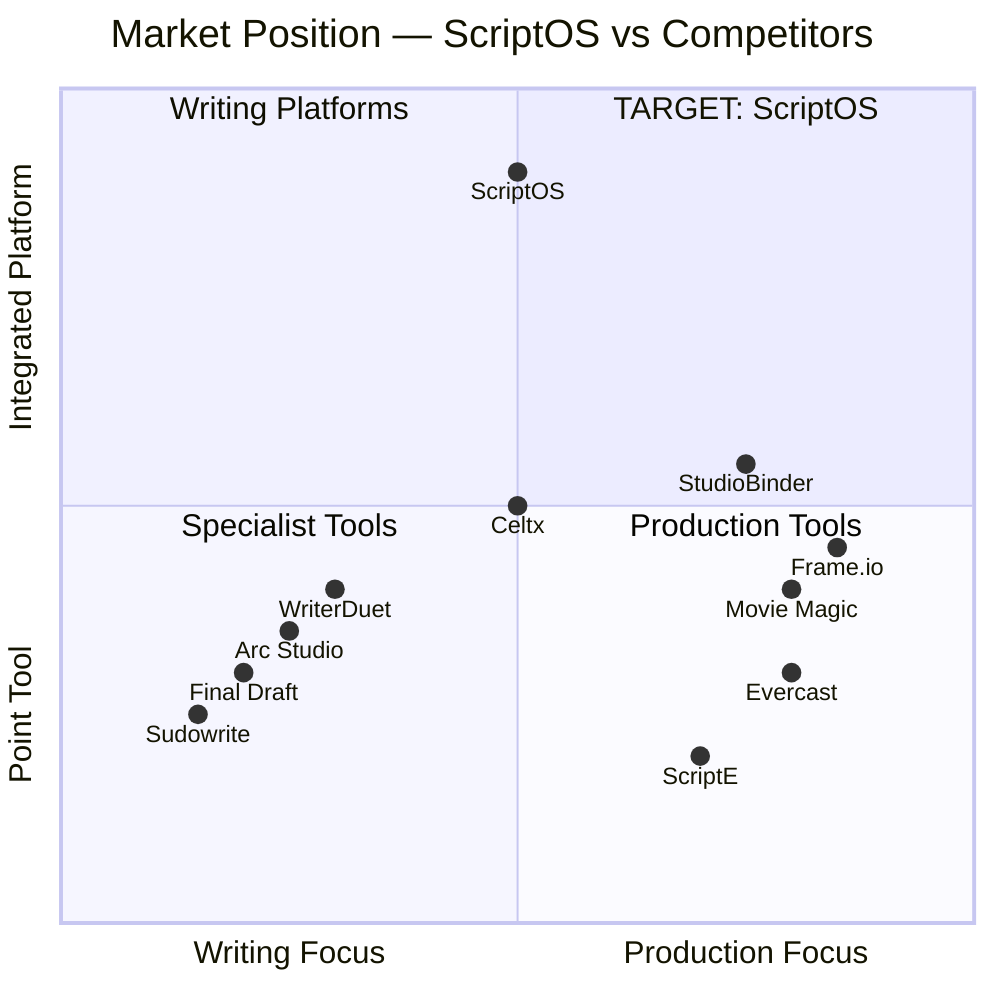

# 01 — Product Vision & Differentiation

## North Star

**Script-as-data with deterministic downstream propagation.**

The screenplay is not a file — it is structured, versioned data that propagates approved changes through every downstream workflow: breakdown, scheduling, budgeting, call sheets, on-set logging, editorial turnover, marketing, and compliance.

## Primary Differentiators

1. **Series Bible Graph** — First-class canon management with rules, provenance, conflict detection, and AI grounding
2. **Script Supervisor On-Set Module** — Integrated into continuity and editorial turnover
3. **Continuity + SeriesTimeline** — Cross-episode story-day tracking for wardrobe, props, injuries, weather
4. **Governed AI** — Every AI suggestion grounded in bible/timeline, attributable via ledger, WGA-compliant
5. **Forensic Watermarking** — Script-level leak tracing at the delivery boundary
6. **Workflow Sagas** — Orchestrated multi-step approval flows, not ad-hoc state machines

## Market Landscape

## Capability Comparison

| Capability | Market Baseline | ScriptOS Stance |
|-----------|----------------|-----------------|
| Script editing | Industry-standard formatting & revisions | Match baseline + expose structured Script AST underneath |
| Collaboration | Realtime editing with offline expectations | CRDT-first with semantic validators for structure edits |
| Series bible / canon | Partial or AI-focused | First-class Bible Graph with rules, provenance, conflict detection |
| Production planning | Breakdown, schedule, call sheets in separate flows | Single publish saga from script → breakdown → schedule → budget → approvals |
| On-set supervision | Niche specialist tools | Dedicated Script Supervisor module integrated into continuity + editorial turnover |
| Compliance & security | Fragmented or external | Built-in AI ledger, watermarking, NDA gates, legal hold, audit trails |

## Target Users

| Persona | Primary Workflows | Key Pain Points Solved |
|---------|-------------------|----------------------|
| Screenwriter | Writing, revision, collaboration | Modern UX, real-time co-editing, bible-aware AI assistance |
| Showrunner | Writers' room, story development, approvals | Beat boards, arc mapping, canon governance across episodes |
| Script Supervisor | On-set logging, continuity, turnover | Offline-first tool, integrated continuity graph, automated lined scripts |
| Line Producer | Breakdown, scheduling, budgeting | Single-source script-to-schedule pipeline, accounting exports |
| Post Supervisor | Editorial turnover, VFX tracking | OTIO-based NLE round-trip, metadata preservation |
| Studio Executive | Compliance, rights, security | AI disclosure reporting, watermarking, NDA enforcement |
