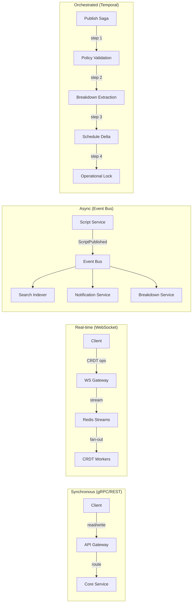

# 02 — Core Architecture

## System Layers

The platform is organized into five layers: client, edge, control plane, core services, and data.

```mermaid
graph TB
    subgraph "Client Layer"
        WEB[Web App - React/TipTap]
        MOBILE[Mobile App - React Native]
        ONSET[On-Set App - Tauri 2.x]
    end

    subgraph "Edge Layer"
        CDN[CDN / Static Assets]
        LB[Load Balancer]
        APIGW[API Gateway]
        WSS[WebSocket Gateway]
    end

    subgraph "Control Plane"
        ORCH[Temporal - Workflow Orchestration]
        FF[Feature Flags - LaunchDarkly/Unleash]
        OBS[Observability - OpenTelemetry]
        SMESH[Service Mesh - Istio/Linkerd]
        AUTH[Auth Service - OIDC/SAML/SCIM]
    end

    subgraph "Core Services"
        SCRIPT[Script Service]
        COLLAB[Collaboration Service - CRDT Sync]
        BIBLE[Series Bible Service]
        BREAKDOWN[Breakdown Service]
        SCHED[Scheduling Service]
        BUDGET[Budgeting Service]
        SUPERVISOR[Script Supervisor Service]
        CONTINUITY[Continuity Service]
        AI[AI Assistance Service]
        IMPORT[Import Pipeline Service]
        LEGAL[Legal / Rights Service]
        SEARCH[Search Service]
        NOTIFY[Notification Service]
        WATER[Watermarking Service]
        INTEG[Integration Hub]
    end

    subgraph "Data Layer"
        PG[(PostgreSQL - Primary Store)]
        NEO[(Neo4j - Bible Graph)]
        ES[(Elasticsearch - Search)]
        S3[(Object Storage - Media)]
        REDIS[(Redis - CRDT Streams + Cache)]
    end

    WEB --> APIGW
    WEB --> WSS
    MOBILE --> APIGW
    ONSET --> APIGW
    ONSET -.->|offline-first via PowerSync| PG

    APIGW --> SCRIPT
    APIGW --> BIBLE
    APIGW --> BREAKDOWN
    WSS --> COLLAB

    COLLAB --> REDIS
    SCRIPT --> PG
    BIBLE --> NEO
    SEARCH --> ES
    AI --> BIBLE
    INTEG --> S3

    ORCH --> SCRIPT
    ORCH --> BREAKDOWN
    ORCH --> SCHED
    ORCH --> BUDGET
    ORCH --> LEGAL
```

## Design Principles

1. **Orchestration over application state machines** — Any multi-step approval or compensation flow goes through Temporal, not hand-coded sagas in application code
2. **Event fan-out for reads, orchestrated workflows for writes** — Notifications and indexing are event-driven; business invariants live inside orchestrated workflows
3. **Separate semantic validation from CRDT convergence** — Collaboration stays fast; production correctness is enforced at publish gates
4. **Delivery-path services, not UI conveniences** — Watermarking, rights policy, and export controls are infrastructure, not features
5. **Story-day chronology above episodes** — Continuity survives rewrites, reshoots, and localized script variants

## Communication Patterns

## Service-to-Service Security

- **mTLS** inside the service mesh (Istio/Linkerd)
- **Signed builds** for all service deployments
- **Feature-flag gated rollouts** for progressive delivery
- **Detailed audit logs** for every state mutation
- **JWT propagation** with service-level scopes

## Deployment Topology

| Environment | Strategy | Notes |
|-------------|----------|-------|
| Development | Docker Compose, single-node | All services, mocked externals |
| Staging | Kubernetes, single-region | Full service mesh, synthetic load |
| Production (SaaS) | Kubernetes, multi-region | Active-active for collaboration, active-passive for orchestration |
| Production (Enterprise) | Single-tenant VPC | Dedicated Neo4j, Postgres, optional self-hosted AI |
