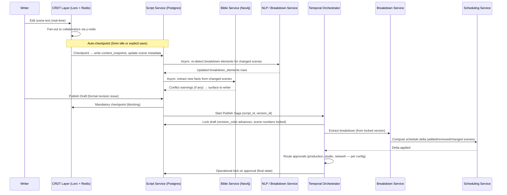
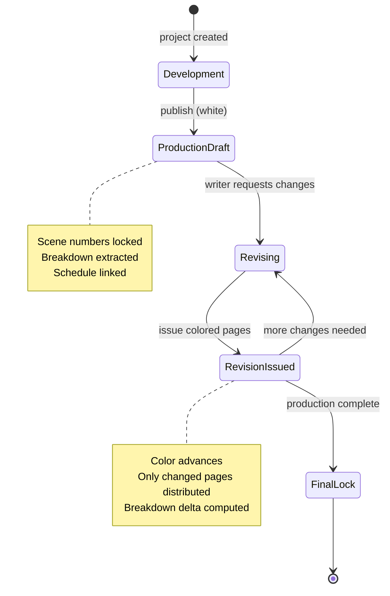

# 03 — Canonical Data Model

> **Status:** FINALIZED — v1.0 (2026-04-09)
> This page is the authoritative source for all ScriptOS data schemas. Every service must conform to these definitions. Changes require an ADR update and a version bump.

## Table of Contents

1. [Script AST](#1-script-ast)
   - [Node Hierarchy](#node-hierarchy)
   - [Base Types](#base-types)
   - [Node Interfaces (all types)](#node-interfaces)
   - [Supporting Types](#supporting-types)
2. [PostgreSQL DDL — AST Layer](#2-postgresql-ddl--ast-layer)
3. [Series Bible Graph — Neo4j Schema](#3-series-bible-graph--neo4j-schema)
   - [Node Labels & Property Schemas](#node-labels--property-schemas)
   - [Relationship Types](#relationship-types)
   - [Cypher Constraints & Indexes](#cypher-constraints--indexes)
   - [Fact Provenance Model](#fact-provenance-model)
   - [Conflict Detection Algorithm](#conflict-detection-algorithm)
4. [SeriesTimeline](#4-seriestimeline)
   - [TypeScript Interfaces](#typescript-interfaces)
   - [PostgreSQL DDL — Timeline Layer](#postgresql-ddl--timeline-layer)
   - [Cross-Episode Continuity Algorithm](#cross-episode-continuity-algorithm)
5. [Revision Color Workflow](#5-revision-color-workflow)
   - [Industry-Standard Color Sequence](#industry-standard-color-sequence)
   - [State Machine](#state-machine)
   - [Lock Rules](#lock-rules)
6. [CRDT ↔ Postgres Persistence Boundary](#6-crdt--postgres-persistence-boundary)
7. [Multi-Format Export](#7-multi-format-export)
   - [FDX (Final Draft XML)](#fdx-final-draft-xml)
   - [Fountain](#fountain)
   - [PDF Layout Rules](#pdf-layout-rules)
8. [Data Flow](#8-data-flow)

---

## 1. Script AST

The screenplay is represented as an adjacency-list tree where every node has a stable UUID v7 identity that survives moves, splits, and merges. Text content lives in CRDT text types at leaf nodes only. Structural operations (scene moves, reordering) use Loro MovableTree or coordinated Yjs operations — never delete+insert.

### Node Hierarchy

```
Project
└── Script (feature) | Season → Episode (series)
    └── TitlePage
    └── Act
        └── Sequence?             (optional grouping — not always used)
            └── Scene
                ├── scene_heading
                ├── action*
                ├── dialogue_group*
                │   ├── character_name
                │   ├── parenthetical?
                │   └── dialogue+
                ├── dual_dialogue?
                │   ├── dialogue_group (left)
                │   └── dialogue_group (right)
                ├── transition?
                ├── section_break?
                ├── synopsis?
                └── note*
```

**Invariants:**
- Every `scene` must have exactly one `scene_heading` as its first child.
- `dialogue_group` must have exactly one `character_name` child.
- `dual_dialogue` must have exactly two `dialogue_group` children, one with `dual_position: 'left'` and one with `dual_position: 'right'`.
- `parent_id` is `null` only for `project` nodes.
- `position` values are fractional (float64) to allow CRDT insertion without renumbering siblings.

---

### Base Types

```typescript
/** UUID v7 — time-ordered, globally unique, no coordination required */
type UUID = string;

/** ISO 8601 timestamp with timezone */
type Timestamp = string;

/**
 * Opaque reference to a CRDT text object within a Loro/Yjs document.
 * The live content lives in the CRDT runtime; this ref is used to locate it.
 * content_snapshot in ast_nodes is the last checkpointed plaintext.
 */
interface CRDTTextRef {
  doc_id: UUID;   // CRDT document ID — maps 1:1 to script_id
  node_id: UUID;  // This AST node's UUID — used as the key within the CRDT doc
}

/** All possible AST node types */
type ScriptNodeType =
  | 'project'
  | 'script'           // standalone feature film
  | 'season'           // series season container
  | 'episode'          // TV episode
  | 'title_page'       // title page block
  | 'act'              // act container (ACT ONE, TEASER, TAG, etc.)
  | 'sequence'         // optional named grouping within an act
  | 'scene'            // scene container
  | 'scene_heading'    // INT./EXT. slug line
  | 'action'           // action / description paragraph
  | 'dialogue_group'   // container: character_name + optional parenthetical + dialogue
  | 'character_name'   // "JAKE" or "JAKE (V.O.)"
  | 'parenthetical'    // (beat), (whispering), etc.
  | 'dialogue'         // spoken dialogue text
  | 'dual_dialogue'    // side-by-side dialogue container
  | 'transition'       // CUT TO:, FADE OUT., DISSOLVE TO:, etc.
  | 'section_break'    // Fountain-style # / ## / ### section headers
  | 'synopsis'         // = Synopsis line (Fountain)
  | 'note';            // [[note]] or production annotation

/** Base fields shared by every node */
interface BaseNode {
  id: UUID;                    // UUID v7, globally unique, immutable
  type: ScriptNodeType;
  parent_id: UUID | null;      // null only for project nodes
  position: number;            // float64 fractional index within parent's children
  created_at: Timestamp;
  created_by: UUID;            // user ID
  updated_at: Timestamp;
  updated_by: UUID;
  version: bigint;             // monotonically increasing, used for optimistic concurrency
  deleted_at: Timestamp | null; // soft delete — tombstoned, not removed
}
```

---

### Node Interfaces

#### ProjectNode

```typescript
interface ProjectNode extends BaseNode {
  type: 'project';
  parent_id: null;
  metadata: {
    title: string;
    format: 'feature' | 'series' | 'short' | 'pilot' | 'limited_series' | 'mini_series';
    status: 'development' | 'pre_production' | 'production' | 'post_production' | 'delivered' | 'archived';
    genre: string[];                    // e.g. ['drama', 'thriller']
    logline: string | null;
    wga_registration: string | null;    // WGA registration number
    wga_script_title_id: string | null;
    studio: string | null;
    network: string | null;
    production_company: string | null;
    bible_graph_id: string | null;      // Neo4j project graph identifier
    timeline_id: UUID | null;           // → story_days root for this project
  };
}
```

#### ScriptNode (Feature Film)

```typescript
interface ScriptNode extends BaseNode {
  type: 'script';
  parent_id: UUID;  // → project
  metadata: {
    title: string;
    subtitle: string | null;
    draft_number: number;               // 1 = first draft, increments per revision issue
    revision_color: RevisionColor;
    revision_date: Timestamp | null;
    locked: boolean;                    // true = production draft; structural changes blocked
    locked_at: Timestamp | null;
    locked_by: UUID | null;
    page_count: number | null;          // auto-calculated in eighths, stored as decimal (e.g. 94.5)
    current_version_id: UUID | null;    // → script_versions.id
    watermark_template_id: UUID | null; // → watermarking service template
  };
}
```

#### SeasonNode

```typescript
interface SeasonNode extends BaseNode {
  type: 'season';
  parent_id: UUID;  // → project
  metadata: {
    season_number: number;
    title: string | null;               // e.g. "The Last Kingdom" for named seasons
    planned_episode_count: number;
    network_order: number | null;       // air order may differ from production order
  };
}
```

#### EpisodeNode

```typescript
interface EpisodeNode extends BaseNode {
  type: 'episode';
  parent_id: UUID;  // → season
  metadata: {
    episode_number: number;             // production number
    episode_number_air: number | null;  // air order (may differ from production order)
    title: string;
    has_teaser: boolean;                // cold open / teaser before main titles
    planned_act_count: number;
    draft_number: number;
    revision_color: RevisionColor;
    revision_date: Timestamp | null;
    locked: boolean;
    locked_at: Timestamp | null;
    locked_by: UUID | null;
    page_count: number | null;
    current_version_id: UUID | null;
    watermark_template_id: UUID | null;
  };
}
```

#### TitlePageNode

```typescript
interface TitlePageNode extends BaseNode {
  type: 'title_page';
  parent_id: UUID;  // → script or episode
  metadata: {
    title: string;
    subtitle: string | null;
    authors: string[];                  // credited writers in display order
    contact: string | null;             // agent/manager contact block
    copyright: string | null;           // "© 2026 Acme Productions"
    draft_label: string | null;         // "PRODUCTION DRAFT", "REVISED DRAFT", "WGA DRAFT"
    revision_color: RevisionColor | null;
    date: string | null;               // display date (not machine timestamp)
    based_on: string | null;           // "Based on the novel by..."
    wga_registration: string | null;
  };
}
```

#### ActNode

```typescript
interface ActNode extends BaseNode {
  type: 'act';
  parent_id: UUID;  // → script or episode
  metadata: {
    act_number: number;   // 1, 2, 3 — or 0 for teaser/tag
    label: string;        // "ACT ONE", "ACT TWO", "TEASER", "COLD OPEN", "TAG", "EPILOGUE"
    page_start: number | null;  // derived from first scene's page position
    page_end: number | null;    // derived from last scene's page position
  };
}
```

#### SequenceNode

```typescript
interface SequenceNode extends BaseNode {
  type: 'sequence';
  parent_id: UUID;  // → act
  metadata: {
    label: string | null;   // descriptive label, e.g. "The Chase", "Backstory"
  };
}
```

#### SceneNode

The most semantically rich node. Metadata is derived from its children and from Bible/Timeline lookups.

```typescript
interface SceneNode extends BaseNode {
  type: 'scene';
  parent_id: UUID;  // → act, sequence

  metadata: {
    // ── Production Identity ─────────────────────────────────────────────
    scene_number: string | null;
    // Derived, not stored identity. Null until first production publish.
    // After lock: new scenes between 12 and 13 become "12A", "12B", etc.
    // Scene numbers are strings to accommodate suffixes.

    scene_number_locked: boolean;
    // true after production draft publish. After this point,
    // renumbering is forbidden — insertion creates A/B suffixes.

    omitted: boolean;
    // Scene cut from the current draft. The node is kept as a tombstone
    // with its number preserved. The editor displays "(OMITTED)".

    omitted_at: Timestamp | null;

    // ── Scene Heading (derived from scene_heading child on checkpoint) ──
    int_ext: 'INT.' | 'EXT.' | 'INT./EXT.' | 'EXT./INT.' | 'I/E' | null;
    location_name: string | null;       // raw location text from slug line
    location_ref: UUID | null;          // → Neo4j Location node ID
    time_of_day: string | null;
    // Canonical values: 'DAY', 'NIGHT', 'DAWN', 'DUSK', 'CONTINUOUS',
    // 'LATER', 'MOMENTS LATER', 'SAME TIME', 'INTERCUT WITH'. Free text allowed.

    // ── Story Chronology ───────────────────────────────────────────────
    story_day_ref: UUID | null;         // → story_days.id
    story_time_of_day_ref: UUID | null; // → time_of_day_slots.id

    // ── Page Measurement ───────────────────────────────────────────────
    page_start: number | null;          // page number (1-indexed, absolute in draft)
    page_length: number;
    // Eighths of a page (industry standard).
    // 1 full page = 8. Half page = 4. Three-eighths = 3.
    // Minimum billable: 1 eighth (0.125 pages).

    // ── Revision ───────────────────────────────────────────────────────
    revision_color: RevisionColor | null;
    // Set when this specific scene is changed in a revision.
    // Null = not changed since last production draft (remains on white pages).
    revision_date: Timestamp | null;

    // ── Cast & Elements (derived from children on checkpoint) ──────────
    speaking_characters: UUID[];        // → Neo4j Character IDs (from dialogue_groups)
    featured_characters: UUID[];        // → Neo4j Character IDs (from action lines, NLP-detected)
    locations: UUID[];                  // → Neo4j Location IDs (primary + secondary)
    props: UUID[];                      // → Neo4j Prop IDs (from breakdown tags)

    // ── Breakdown Tags ─────────────────────────────────────────────────
    breakdown_tags: BreakdownTag[];
    // Authoritative list of all tagged production elements in this scene.
    // Auto-detected by NLP pipeline, manually confirmed by breakdown dept.

    // ── Stripboard ─────────────────────────────────────────────────────
    color_code: string | null;
    // Stripboard color coding for this scene (production-specific).
    // Not to be confused with revision_color.
    // Typically maps to: interior/exterior, day/night, set/location.

    shoot_day: number | null;           // assigned shoot day (from scheduling service)
    estimated_shoot_duration: number | null; // in minutes, from scheduling
  };
}
```

#### SceneHeadingNode

```typescript
interface SceneHeadingNode extends BaseNode {
  type: 'scene_heading';
  parent_id: UUID;        // → scene (always the first child)
  content: CRDTTextRef;  // live CRDT text: "INT. PRECINCT - BULLPEN - NIGHT"
  content_snapshot: string | null;  // last checkpoint copy (plaintext)

  metadata: {
    // Parsed components — derived from content_snapshot on each checkpoint.
    // Source of truth is content_snapshot; these are cached for query performance.
    int_ext: 'INT.' | 'EXT.' | 'INT./EXT.' | 'EXT./INT.' | 'I/E' | null;
    location_parts: string[];   // tokenized: ["PRECINCT", "BULLPEN"]
    time_of_day: string | null;
  };
}
```

#### ActionNode

```typescript
interface ActionNode extends BaseNode {
  type: 'action';
  parent_id: UUID;  // → scene
  content: CRDTTextRef;
  content_snapshot: string | null;

  metadata: {
    centered: boolean;
    // Centered action blocks are rare but valid in some formatting styles
    // (e.g. "SMASH CUT TO BLACK." centered on the page).
  };
}
```

#### DialogueGroupNode

```typescript
interface DialogueGroupNode extends BaseNode {
  type: 'dialogue_group';
  parent_id: UUID;  // → scene or dual_dialogue

  metadata: {
    character_ref: UUID | null;
    // → Neo4j Character node ID. Resolved from the character_name child's
    // content_snapshot after checkpoint. Null while unresolved.

    dual_position: 'left' | 'right' | null;
    // Only set when this dialogue_group is a child of dual_dialogue.
  };
}
```

#### CharacterNameNode

```typescript
interface CharacterNameNode extends BaseNode {
  type: 'character_name';
  parent_id: UUID;  // → dialogue_group (always the first child)
  content: CRDTTextRef;  // "DETECTIVE SARAH COLE" or "JAKE (V.O.)"
  content_snapshot: string | null;

  metadata: {
    character_ref: UUID | null;
    // → Neo4j Character node ID. Resolved by the character resolution service
    // after content checkpoint. Fuzzy-matched against known characters.

    name_resolved: string | null;
    // Canonical character name after resolution. e.g. "JAKE" resolves to
    // the Character node for "Jake Mercer". Stored separately from raw content.

    extension: 'V.O.' | 'O.S.' | 'O.C.' | "CONT'D" | 'PRE-LAP' | 'FILTERED' | string | null;
    // Parsed from the content — the suffix in parentheses, if any.
    // Stored separately so extension can be queried without string parsing.
  };
}
```

#### ParentheticalNode

```typescript
interface ParentheticalNode extends BaseNode {
  type: 'parenthetical';
  parent_id: UUID;  // → dialogue_group
  content: CRDTTextRef;  // "(beat)", "(whispering)", "(looks away)"
  content_snapshot: string | null;
  metadata: Record<string, never>;
}
```

#### DialogueNode

```typescript
interface DialogueNode extends BaseNode {
  type: 'dialogue';
  parent_id: UUID;  // → dialogue_group
  content: CRDTTextRef;
  content_snapshot: string | null;
  metadata: Record<string, never>;
}
```

#### DualDialogueNode

```typescript
interface DualDialogueNode extends BaseNode {
  type: 'dual_dialogue';
  parent_id: UUID;  // → scene
  // children: exactly [dialogue_group (left), dialogue_group (right)]
  metadata: Record<string, never>;
}
```

#### TransitionNode

```typescript
type TransitionType =
  | 'CUT_TO'
  | 'SMASH_CUT_TO'
  | 'MATCH_CUT_TO'
  | 'JUMP_CUT_TO'
  | 'DISSOLVE_TO'
  | 'FADE_OUT'
  | 'FADE_IN'
  | 'FADE_TO_BLACK'
  | 'IRIS_OUT'
  | 'WIPE_TO'
  | 'custom';

interface TransitionNode extends BaseNode {
  type: 'transition';
  parent_id: UUID;  // → scene (conventionally the last element) or act
  content: CRDTTextRef;  // "CUT TO:", "FADE OUT.", etc.
  content_snapshot: string | null;

  metadata: {
    transition_type: TransitionType;
    // Parsed from content_snapshot. 'custom' for non-standard transitions.
  };
}
```

#### SectionBreakNode

```typescript
interface SectionBreakNode extends BaseNode {
  type: 'section_break';
  parent_id: UUID;  // → scene, act, or script level
  content: CRDTTextRef;
  content_snapshot: string | null;

  metadata: {
    depth: 1 | 2 | 3;
    // Fountain convention: # = depth 1, ## = depth 2, ### = depth 3
  };
}
```

#### SynopsisNode

```typescript
interface SynopsisNode extends BaseNode {
  type: 'synopsis';
  parent_id: UUID;  // → scene or act
  content: CRDTTextRef;  // Fountain: "= A brief description of the scene."
  content_snapshot: string | null;
  metadata: Record<string, never>;
}
```

#### NoteNode

```typescript
type NoteType = 'writer' | 'production' | 'supervisor' | 'director' | 'script_editor' | 'legal';
type NoteVisibility = 'writer' | 'director' | 'producer' | 'script_supervisor' | 'production' | 'all';

interface NoteNode extends BaseNode {
  type: 'note';
  parent_id: UUID;  // any node type
  content: CRDTTextRef;
  content_snapshot: string | null;

  metadata: {
    note_type: NoteType;
    visible_to: NoteVisibility[];   // access control — which roles can see this note
    resolved: boolean;
    resolved_by: UUID | null;
    resolved_at: Timestamp | null;
    // Notes are not exported to FDX/Fountain/PDF unless explicitly included.
  };
}
```

---

### Supporting Types

#### BreakdownTag

```typescript
type BreakdownCategory =
  | 'cast'           // speaking cast members
  | 'background'     // extras / atmosphere / featured background
  | 'stunt'          // stunt performers, stunt requirements
  | 'vehicle'        // picture cars, transportation
  | 'prop'           // hand props, hero props
  | 'wardrobe'       // costumes, specific clothing items
  | 'makeup_hair'    // notable makeup/hair requirements (not standard continuity)
  | 'vfx'            // visual effects shots
  | 'sfx'            // practical special effects (pyro, rain, etc.)
  | 'sound'          // specific sound requirements
  | 'music'          // source music, score cues
  | 'set_dressing'   // notable set decoration elements
  | 'animal'         // animals in scene
  | 'location'       // specific location requirements or permits
  | 'security'       // security requirements
  | 'medical'        // on-set medical requirements
  | 'production_note'; // catch-all for department-specific notes

type BreakdownTagSource = 'auto_detected' | 'manual' | 'ai_suggested' | 'imported';

interface BreakdownTag {
  id: UUID;
  scene_id: UUID;
  category: BreakdownCategory;
  label: string;                  // "POLICE CAR (HERO)", "WEDDING DRESS", "JAKE - DOUBLE"
  entity_ref: UUID | null;        // → Neo4j entity (Character, Prop, Vehicle, etc.)
  source: BreakdownTagSource;
  source_span: { start: number; end: number } | null;
  // Character offset range within the scene's concatenated content_snapshot.
  // Used to highlight the detected text in the editor.
  confirmed: boolean;             // human-confirmed (not just AI-suggested)
  confirmed_by: UUID | null;
  confirmed_at: Timestamp | null;
  notes: string | null;
  department: string | null;      // e.g. "Art Department", "Wardrobe"
  created_at: Timestamp;
  updated_at: Timestamp;
}
```

#### RevisionColor

```typescript
/**
 * Industry-standard screenplay revision color sequence.
 * Pages changed in a revision are printed on paper of the current color.
 * After Tan (9th revision), productions typically restart with "2nd White" etc.
 * The sequence below covers the universal WGA/industry standard.
 */
type RevisionColor =
  | 'white'         // Production draft (1st issue)
  | 'blue'          // 1st revision
  | 'pink'          // 2nd revision
  | 'yellow'        // 3rd revision
  | 'green'         // 4th revision
  | 'goldenrod'     // 5th revision
  | 'buff'          // 6th revision
  | 'salmon'        // 7th revision
  | 'cherry'        // 8th revision
  | 'tan'           // 9th revision
  | 'second_white'  // 10th revision
  | 'second_blue'   // 11th revision
  | 'second_pink';  // 12th revision (rare, but occurs on long productions)

const REVISION_COLOR_SEQUENCE: RevisionColor[] = [
  'white', 'blue', 'pink', 'yellow', 'green',
  'goldenrod', 'buff', 'salmon', 'cherry', 'tan',
  'second_white', 'second_blue', 'second_pink',
];

/** Display hex values for UI color coding of revision pages */
const REVISION_COLOR_HEX: Record<RevisionColor, string> = {
  white:        '#FFFFFF',
  blue:         '#ADD8E6',
  pink:         '#FFB6C1',
  yellow:       '#FFFFE0',
  green:        '#90EE90',
  goldenrod:    '#DAA520',
  buff:         '#F0DC82',
  salmon:       '#FA8072',
  cherry:       '#DE3163',
  tan:          '#D2B48C',
  second_white: '#FFFFFF',
  second_blue:  '#ADD8E6',
  second_pink:  '#FFB6C1',
};
```

#### Union type for all AST nodes

```typescript
type ASTNode =
  | ProjectNode
  | ScriptNode
  | SeasonNode
  | EpisodeNode
  | TitlePageNode
  | ActNode
  | SequenceNode
  | SceneNode
  | SceneHeadingNode
  | ActionNode
  | DialogueGroupNode
  | CharacterNameNode
  | ParentheticalNode
  | DialogueNode
  | DualDialogueNode
  | TransitionNode
  | SectionBreakNode
  | SynopsisNode
  | NoteNode;

/** Type guard helpers */
function isLeafNode(node: ASTNode): node is SceneHeadingNode | ActionNode | CharacterNameNode | ParentheticalNode | DialogueNode | TransitionNode | SectionBreakNode | SynopsisNode | NoteNode {
  return 'content' in node;
}

function hasMetadataField<K extends string>(node: ASTNode, key: K): boolean {
  return key in (node as any).metadata;
}
```

---

## 2. PostgreSQL DDL — AST Layer

```sql
-- ============================================================
-- Extensions
-- ============================================================
CREATE EXTENSION IF NOT EXISTS "pgcrypto";    -- gen_random_uuid()
CREATE EXTENSION IF NOT EXISTS "pg_trgm";     -- trigram search on content_snapshot
CREATE EXTENSION IF NOT EXISTS "btree_gin";   -- GIN index on numeric types

-- ============================================================
-- Users (referenced throughout — owned by Auth service)
-- ============================================================
-- Not created here; Auth service owns this table.
-- Referenced as UUID foreign keys throughout.

-- ============================================================
-- Projects
-- ============================================================
CREATE TABLE projects (
  id                   UUID PRIMARY KEY DEFAULT gen_random_uuid(),
  title                TEXT NOT NULL,
  format               TEXT NOT NULL CHECK (format IN (
                         'feature', 'series', 'short', 'pilot',
                         'limited_series', 'mini_series')),
  status               TEXT NOT NULL DEFAULT 'development' CHECK (status IN (
                         'development', 'pre_production', 'production',
                         'post_production', 'delivered', 'archived')),
  genre                TEXT[]       NOT NULL DEFAULT '{}',
  logline              TEXT,
  wga_registration     TEXT,
  studio               TEXT,
  network              TEXT,
  production_company   TEXT,
  bible_graph_id       TEXT,        -- Neo4j project graph identifier (opaque string)
  timeline_id          UUID,        -- → story_days root (self-reference set after insert)
  created_at           TIMESTAMPTZ  NOT NULL DEFAULT NOW(),
  created_by           UUID         NOT NULL,
  updated_at           TIMESTAMPTZ  NOT NULL DEFAULT NOW(),
  updated_by           UUID         NOT NULL,
  deleted_at           TIMESTAMPTZ
);

CREATE INDEX projects_status      ON projects(status) WHERE deleted_at IS NULL;
CREATE INDEX projects_created_by  ON projects(created_by);

-- ============================================================
-- Scripts (features) and Episodes share this table.
-- season_number / episode_number are NULL for features.
-- ============================================================
CREATE TABLE scripts (
  id                     UUID PRIMARY KEY DEFAULT gen_random_uuid(),
  project_id             UUID         NOT NULL REFERENCES projects(id) ON DELETE RESTRICT,
  season_number          SMALLINT,                   -- NULL for features
  episode_number         SMALLINT,                   -- NULL for features
  episode_number_air     SMALLINT,                   -- air order, may differ
  title                  TEXT         NOT NULL,
  subtitle               TEXT,
  format                 TEXT         NOT NULL DEFAULT 'script'
                           CHECK (format IN ('script', 'episode', 'pilot')),
  draft_number           SMALLINT     NOT NULL DEFAULT 1,
  revision_color         TEXT         NOT NULL DEFAULT 'white',
  revision_date          TIMESTAMPTZ,
  locked                 BOOLEAN      NOT NULL DEFAULT FALSE,
  locked_at              TIMESTAMPTZ,
  locked_by              UUID,
  page_count             NUMERIC(7,3),               -- in eighths; 8.000 = 1 page
  current_version_id     UUID,                       -- → script_versions.id (set after first version)
  watermark_template_id  UUID,
  has_teaser             BOOLEAN      NOT NULL DEFAULT FALSE,
  planned_act_count      SMALLINT,
  created_at             TIMESTAMPTZ  NOT NULL DEFAULT NOW(),
  created_by             UUID         NOT NULL,
  updated_at             TIMESTAMPTZ  NOT NULL DEFAULT NOW(),
  updated_by             UUID         NOT NULL,
  deleted_at             TIMESTAMPTZ
);

CREATE INDEX scripts_project_id   ON scripts(project_id) WHERE deleted_at IS NULL;
CREATE INDEX scripts_locked       ON scripts(locked) WHERE deleted_at IS NULL;
-- Enforces one production number per season
CREATE UNIQUE INDEX scripts_episode_unique
  ON scripts(project_id, season_number, episode_number)
  WHERE episode_number IS NOT NULL AND deleted_at IS NULL;

-- ============================================================
-- AST Nodes — the tree
-- ============================================================
CREATE TABLE ast_nodes (
  -- Identity
  id               UUID           PRIMARY KEY,
  -- UUID v7 generated by the application layer (not DB default)
  -- so the CRDT doc and Postgres agree on the same ID.

  script_id        UUID           NOT NULL REFERENCES scripts(id) ON DELETE CASCADE,
  type             TEXT           NOT NULL,

  -- Tree structure
  parent_id        UUID           REFERENCES ast_nodes(id) ON DELETE RESTRICT,
  -- ON DELETE RESTRICT: deleting a parent without first deleting children is an error.
  -- The application soft-deletes via deleted_at.

  position         DOUBLE PRECISION NOT NULL DEFAULT 0,
  -- Fractional indexing (Figma / Linear pattern).
  -- Insertion between positions 1.0 and 2.0 → 1.5.
  -- Precision sufficient for ~2^52 insertions before rebalancing.

  -- Content
  content_snapshot TEXT,
  -- Plaintext checkpoint of CRDT text content. NULL for non-leaf nodes.
  -- Updated on every CRDT checkpoint event.
  -- Never used as source of truth for live editing — CRDT is authoritative.

  -- Typed metadata (varies by node type)
  metadata         JSONB          NOT NULL DEFAULT '{}',
  -- Validated against per-type JSON schema at the application layer.
  -- NOT validated by Postgres CHECK — too complex and changes over time.

  -- Revision tracking
  revision_color   TEXT,
  -- Set when this node is created or substantively modified in a revision.
  -- NULL = unchanged since last production draft issue.

  -- Audit
  created_at       TIMESTAMPTZ    NOT NULL DEFAULT NOW(),
  created_by       UUID           NOT NULL,
  updated_at       TIMESTAMPTZ    NOT NULL DEFAULT NOW(),
  updated_by       UUID           NOT NULL,
  version          BIGINT         NOT NULL DEFAULT 1,
  -- Incremented on every UPDATE. Used for optimistic concurrency in the
  -- Script Service. The CRDT layer is the real concurrency mechanism;
  -- this is a safety net for direct-to-Postgres writes (snapshots, migrations).

  deleted_at       TIMESTAMPTZ
  -- Soft delete. Omitted nodes use deleted_at IS NOT NULL + metadata.omitted = true.
  -- Hard deletes are not permitted on production-locked scripts.
);

-- ── Indexes ──────────────────────────────────────────────────────────────────

-- Primary tree navigation (most common query: get children of a node)
CREATE INDEX ast_nodes_parent_pos
  ON ast_nodes(parent_id, position)
  WHERE deleted_at IS NULL;

-- Script-level queries (get all nodes for a script)
CREATE INDEX ast_nodes_script_id
  ON ast_nodes(script_id)
  WHERE deleted_at IS NULL;

-- Type filtering (get all scenes in a script, get all action nodes, etc.)
CREATE INDEX ast_nodes_script_type
  ON ast_nodes(script_id, type)
  WHERE deleted_at IS NULL;

-- Full-text search on checkpointed content
CREATE INDEX ast_nodes_content_trgm
  ON ast_nodes USING GIN(content_snapshot gin_trgm_ops)
  WHERE content_snapshot IS NOT NULL AND deleted_at IS NULL;

-- JSONB metadata queries (scene metadata, character refs, etc.)
CREATE INDEX ast_nodes_metadata
  ON ast_nodes USING GIN(metadata jsonb_path_ops);

-- Character reference lookups (find all scenes where a character appears)
CREATE INDEX ast_nodes_characters
  ON ast_nodes USING GIN((metadata -> 'speaking_characters') jsonb_path_ops)
  WHERE type = 'scene' AND deleted_at IS NULL;

-- Location reference lookups
CREATE INDEX ast_nodes_location_ref
  ON ast_nodes((metadata ->> 'location_ref'))
  WHERE type = 'scene' AND (metadata ->> 'location_ref') IS NOT NULL AND deleted_at IS NULL;

-- Revision color (for generating colored revision pages)
CREATE INDEX ast_nodes_revision_color
  ON ast_nodes(script_id, revision_color)
  WHERE revision_color IS NOT NULL AND deleted_at IS NULL;

-- ============================================================
-- Script Versions — immutable snapshots
-- ============================================================
CREATE TABLE script_versions (
  id               UUID         PRIMARY KEY DEFAULT gen_random_uuid(),
  script_id        UUID         NOT NULL REFERENCES scripts(id) ON DELETE RESTRICT,
  version_number   INT          NOT NULL,
  revision_color   TEXT         NOT NULL,
  revision_date    TIMESTAMPTZ  NOT NULL DEFAULT NOW(),
  label            TEXT,
  -- Human-readable: "PRODUCTION DRAFT", "BLUE REVISED", "NETWORK DRAFT"

  snapshot         JSONB        NOT NULL,
  -- Full denormalized AST snapshot at this point in time.
  -- Format: { nodes: ASTNode[], metadata: ScriptVersionMeta }
  -- Used for: export, diff, rollback, watermarked copies.

  crdt_snapshot    BYTEA,
  -- Serialized Loro/Yjs document state at checkpoint time.
  -- Used to restore a CRDT session from a specific version.
  -- May be NULL for pre-CRDT imported scripts.

  page_count       NUMERIC(7,3),
  locked           BOOLEAN      NOT NULL DEFAULT FALSE,
  -- true = production lock applied. This version is the source of truth
  -- for breakdown, scheduling, and budgeting until the next revision.

  watermark_id     UUID,
  -- If this version was exported with a forensic watermark, the watermark ID.

  created_at       TIMESTAMPTZ  NOT NULL DEFAULT NOW(),
  created_by       UUID         NOT NULL,

  UNIQUE (script_id, version_number)
);

CREATE INDEX script_versions_script
  ON script_versions(script_id, version_number DESC);

-- ============================================================
-- Breakdown Elements — normalized from scene metadata tags
-- ============================================================
-- This table is the canonical source for the Breakdown Service.
-- The breakdown_tags array in scene metadata is a denormalized cache;
-- this table is authoritative and always in sync.

CREATE TABLE breakdown_elements (
  id               UUID         PRIMARY KEY DEFAULT gen_random_uuid(),
  scene_id         UUID         NOT NULL REFERENCES ast_nodes(id) ON DELETE CASCADE,
  script_id        UUID         NOT NULL REFERENCES scripts(id) ON DELETE CASCADE,
  version_id       UUID         REFERENCES script_versions(id),
  -- If NULL, belongs to the current working draft.

  category         TEXT         NOT NULL,
  label            TEXT         NOT NULL,
  entity_ref       UUID,        -- → Neo4j entity (Character, Prop, Vehicle, etc.)
  entity_type      TEXT,        -- 'character' | 'prop' | 'vehicle' | 'location' | etc.

  source           TEXT         NOT NULL DEFAULT 'auto_detected'
                     CHECK (source IN ('auto_detected', 'manual', 'ai_suggested', 'imported')),
  source_start     INT,         -- char offset in scene content_snapshot
  source_end       INT,         -- char offset end

  confirmed        BOOLEAN      NOT NULL DEFAULT FALSE,
  confirmed_by     UUID,
  confirmed_at     TIMESTAMPTZ,

  notes            TEXT,
  department       TEXT,

  created_at       TIMESTAMPTZ  NOT NULL DEFAULT NOW(),
  updated_at       TIMESTAMPTZ  NOT NULL DEFAULT NOW()
);

CREATE INDEX breakdown_elements_scene    ON breakdown_elements(scene_id);
CREATE INDEX breakdown_elements_script   ON breakdown_elements(script_id);
CREATE INDEX breakdown_elements_category ON breakdown_elements(category);
CREATE INDEX breakdown_elements_entity   ON breakdown_elements(entity_ref) WHERE entity_ref IS NOT NULL;
CREATE INDEX breakdown_elements_version  ON breakdown_elements(version_id) WHERE version_id IS NOT NULL;
```

---

## 3. Series Bible Graph — Neo4j Schema

All Bible Graph queries use the Cypher query language. The graph is scoped per project via the `project_id` property on every node.

### Node Labels & Property Schemas

#### `Character`

```cypher
// Properties on every :Character node
{
  id:               STRING,   // UUID v7
  project_id:       STRING,   // UUID of the ScriptOS project
  name:             STRING,   // canonical display name: "Detective Sarah Cole"
  aliases:          [STRING], // ["Sarah", "Cole", "Detective Cole", "SARAH COLE"]
  status:           STRING,   // 'alive' | 'deceased' | 'unknown' | 'recurring' | 'guest' | 'mentioned'
  type:             STRING,   // 'main' | 'recurring' | 'guest' | 'featured_background' | 'historical'
  first_appearance: STRING,   // episode_id or 'pre_series' or null
  created_at:       DATETIME,
  created_by:       STRING    // user UUID
}
```

#### `Location`

```cypher
{
  id:               STRING,
  project_id:       STRING,
  name:             STRING,   // canonical: "PRECINCT 9 - BULLPEN"
  aliases:          [STRING], // shorthand names used in script slugs
  int_ext:          STRING,   // 'INT' | 'EXT' | 'BOTH'
  location_type:    STRING,   // 'standing_set' | 'practical_location' | 'stage' | 'virtual' | 'stock'
  address:          STRING,   // real-world address if practical location
  first_appearance: STRING,
  created_at:       DATETIME,
  created_by:       STRING
}
```

#### `Prop`

```cypher
{
  id:               STRING,
  project_id:       STRING,
  name:             STRING,   // "JAKE'S SERVICE REVOLVER"
  description:      STRING,
  is_hero:          BOOLEAN,  // hero prop = specific identifiable item (not generic)
  department:       STRING,   // 'props' | 'weapons' | 'special_props'
  created_at:       DATETIME
}
```

#### `Vehicle`

```cypher
{
  id:               STRING,
  project_id:       STRING,
  name:             STRING,   // "JAKE'S MUSTANG (HERO)" or "POLICE CRUISER (PICTURE)"
  make:             STRING,
  model:            STRING,
  year:             INTEGER,
  color:            STRING,
  is_picture_car:   BOOLEAN,  // appears on camera (vs. transport)
  created_at:       DATETIME
}
```

#### `Organization`

```cypher
{
  id:               STRING,
  project_id:       STRING,
  name:             STRING,   // "PRECINCT 9", "THE SYNDICATE"
  org_type:         STRING,   // 'law_enforcement' | 'criminal' | 'corporate' | 'government' | 'social' | 'other'
  description:      STRING,
  created_at:       DATETIME
}
```

#### `StoryEvent`

```cypher
{
  id:               STRING,
  project_id:       STRING,
  name:             STRING,   // "THE MURDER OF THOMAS CHEN"
  description:      STRING,
  story_day_id:     STRING,   // → StoryDay UUID in Postgres
  is_inciting:      BOOLEAN,  // inciting incident
  is_turning_point: BOOLEAN,
  is_climax:        BOOLEAN,
  created_at:       DATETIME
}
```

#### `Fact`

```cypher
{
  id:               STRING,
  project_id:       STRING,
  entity_id:        STRING,   // UUID of the entity this fact describes
  entity_label:     STRING,   // 'Character' | 'Location' | 'Prop' | etc. (denormalized for queries)
  category:         STRING,
  // 'biography' | 'appearance' | 'relationship' | 'ability' | 'possession'
  // | 'location_detail' | 'history' | 'rule' | 'injury' | 'state'
  statement:        STRING,   // "Jake lost his right hand in the factory fire"
  source_type:      STRING,   // 'script' | 'writer_entry' | 'ai_suggested' | 'show_bible'
  source_ref:       STRING,   // scene UUID, document ID, or null
  introduced_in:    STRING,   // episode UUID or 'pre_series'
  superseded_by:    STRING,   // fact UUID if this fact was retconned, else null
  confidence:       FLOAT,    // 0.0–1.0; AI-suggested facts start at 0.7
  approved_by:      STRING,   // user UUID, null if pending
  approved_at:      DATETIME,
  embedding:        [FLOAT],  // vector embedding for semantic similarity search
  created_at:       DATETIME
}
```

#### `Rule`

```cypher
{
  id:               STRING,
  project_id:       STRING,
  statement:        STRING,   // "The magic system requires a blood price for every use"
  rule_type:        STRING,   // 'world_rule' | 'character_rule' | 'tone_rule' | 'style_rule' | 'production_rule'
  severity:         STRING,   // 'must' | 'should' | 'prefer'
  approved_by:      STRING,
  created_at:       DATETIME
}
```

#### `Arc`

```cypher
{
  id:               STRING,
  project_id:       STRING,
  title:            STRING,   // "Jake's redemption arc"
  description:      STRING,
  arc_type:         STRING,   // 'character' | 'story' | 'thematic' | 'relationship' | 'series'
  status:           STRING,   // 'planned' | 'active' | 'resolved' | 'abandoned'
  created_at:       DATETIME
}
```

#### `LoreEntry`

```cypher
{
  id:               STRING,
  project_id:       STRING,
  title:            STRING,   // "The Rules of the Blood Magic System"
  body:             STRING,   // extended lore text (may be long)
  category:         STRING,   // 'world_building' | 'history' | 'mythology' | 'technology' | 'culture'
  created_at:       DATETIME
}
```

#### `VoiceProfile`

```cypher
{
  id:                  STRING,
  project_id:          STRING,
  character_id:        STRING,    // → Character.id
  vocabulary_level:    STRING,    // 'simple' | 'educated' | 'technical' | 'street' | 'formal' | 'archaic'
  speech_patterns:     [STRING],  // ["speaks in incomplete sentences", "uses military jargon"]
  catchphrases:        [STRING],  // recurring phrases
  forbidden_words:     [STRING],  // words this character would NEVER say
  sentence_length:     STRING,    // 'short' | 'medium' | 'long' | 'varied'
  formality:           FLOAT,     // 0.0 (very casual) → 1.0 (very formal)
  reference_scene_ids: [STRING],  // scene UUIDs used for few-shot AI prompting
  ai_prompt_prefix:    STRING,    // "You are writing dialogue for Jake, a burned-out detective..."
  updated_at:          DATETIME
}
```

#### `SceneRef` and `EpisodeRef`

Lightweight pointer nodes used for provenance edges — avoids circular dependencies.

```cypher
// SceneRef
{ id: STRING, scene_id: STRING, script_id: STRING, scene_number: STRING }

// EpisodeRef
{ id: STRING, episode_id: STRING, episode_number: INTEGER, season_number: INTEGER }
```

---

### Relationship Types

```cypher
// ── Character relationships ───────────────────────────────────────────────────

// A character has a canonical fact
(c:Character)-[:HAS_FACT { category: STRING, weight: FLOAT }]->(f:Fact)

// A character follows a story arc, with their role in it
(c:Character)-[:FOLLOWS_ARC { role: STRING }]->(a:Arc)
// role: 'protagonist' | 'antagonist' | 'foil' | 'mentor' | 'supporting'

// A character has a voice profile (one per character per project)
(c:Character)-[:HAS_VOICE]->(v:VoiceProfile)

// Interpersonal relationships between characters
(c:Character)-[:KNOWS {
  relationship_type: STRING,  // 'partner', 'rival', 'family', 'romantic', 'former_ally', etc.
  since_episode:     STRING,  // episode UUID when relationship was established (or 'pre_series')
  status:            STRING   // 'active' | 'severed' | 'deceased' | 'estranged'
}]->(c2:Character)

// Character's primary and secondary locations
(c:Character)-[:FREQUENTS {
  frequency: STRING  // 'primary' | 'secondary' | 'rare'
}]->(l:Location)

// Character's organizational membership
(c:Character)-[:MEMBER_OF {
  role: STRING,             // "Detective", "Boss", "Associate"
  joined_episode: STRING,
  left_episode:   STRING    // null if still active
}]->(o:Organization)

// Which scenes a character appears in (for reverse lookups)
(c:Character)-[:APPEARS_IN { role: STRING }]->(s:SceneRef)
// role: 'speaking' | 'featured' | 'mentioned' | 'background'

// ── Location relationships ─────────────────────────────────────────────────

(l:Location)-[:HAS_FACT { category: STRING }]->(f:Fact)
(l:Location)-[:CONTAINS]->(l2:Location)
// "PRECINCT 9" CONTAINS "PRECINCT 9 - BULLPEN", "PRECINCT 9 - INTERROGATION ROOM 2"

(l:Location)-[:NEAR { distance_meters: INTEGER }]->(l2:Location)
// Spatial proximity (for scheduling optimization)

// ── Prop & Vehicle relationships ─────────────────────────────────────────────

(p:Prop)-[:OWNED_BY {
  since_episode: STRING,
  lost_in_episode: STRING  // null if still owned
}]->(c:Character)

(p:Prop)-[:USED_IN]->(s:SceneRef)
(v:Vehicle)-[:DRIVEN_BY { episode_id: STRING }]->(c:Character)
(v:Vehicle)-[:USED_IN]->(s:SceneRef)
(p:Prop)-[:HAS_FACT { category: STRING }]->(f:Fact)
(v:Vehicle)-[:HAS_FACT { category: STRING }]->(f:Fact)

// ── Organization relationships ────────────────────────────────────────────────

(o:Organization)-[:ALLIED_WITH { since_episode: STRING }]->(o2:Organization)
(o:Organization)-[:OPPOSED_TO { since_episode: STRING }]->(o2:Organization)
(o:Organization)-[:HAS_FACT { category: STRING }]->(f:Fact)

// ── Story Event relationships ─────────────────────────────────────────────────

(e:StoryEvent)-[:INVOLVES {
  role: STRING  // 'victim', 'perpetrator', 'witness', 'investigator', 'bystander'
}]->(c:Character)

(e:StoryEvent)-[:OCCURS_AT]->(l:Location)
(e:StoryEvent)-[:CAUSES { lag_story_days: INTEGER }]->(e2:StoryEvent)
(e:StoryEvent)-[:REFERENCED_IN]->(s:SceneRef)

// ── Arc relationships ─────────────────────────────────────────────────────────

(a:Arc)-[:SPANS_EPISODES {
  from_episode: STRING,
  to_episode:   STRING  // null = ongoing
}]->(ep:EpisodeRef)

(a:Arc)-[:INVOLVES_CHARACTER {
  role: STRING
}]->(c:Character)

(a:Arc)-[:OCCURS_PRIMARILY_AT]->(l:Location)

// ── Rule & Lore relationships ─────────────────────────────────────────────────

(r:Rule)-[:APPLIES_TO]->(c:Character)
(r:Rule)-[:APPLIES_TO]->(l:Location)
(r:Rule)-[:GOVERNS]->(a:Arc)
(r:Rule)-[:GOVERNS]->(le:LoreEntry)

(le:LoreEntry)-[:PART_OF_WORLD { category: STRING }]->(a:Arc)
(le:LoreEntry)-[:GOVERNS]->(c:Character)
(le:LoreEntry)-[:GOVERNS]->(l:Location)

// ── Fact metadata relationships ───────────────────────────────────────────────

(f:Fact)-[:SOURCE]->(s:SceneRef)     // fact was established in this scene
(f:Fact)-[:SOURCE]->(ep:EpisodeRef)  // fact was established at episode level (not scene-specific)
(f:Fact)-[:SUPERSEDES]->(f2:Fact)    // retcon chain: f is the replacement for f2
```

---

### Cypher Constraints & Indexes

```cypher
// ── Uniqueness constraints (all nodes require unique IDs) ─────────────────────
CREATE CONSTRAINT character_id  FOR (n:Character)   REQUIRE n.id IS UNIQUE;
CREATE CONSTRAINT location_id   FOR (n:Location)    REQUIRE n.id IS UNIQUE;
CREATE CONSTRAINT prop_id       FOR (n:Prop)        REQUIRE n.id IS UNIQUE;
CREATE CONSTRAINT vehicle_id    FOR (n:Vehicle)     REQUIRE n.id IS UNIQUE;
CREATE CONSTRAINT org_id        FOR (n:Organization) REQUIRE n.id IS UNIQUE;
CREATE CONSTRAINT event_id      FOR (n:StoryEvent)  REQUIRE n.id IS UNIQUE;
CREATE CONSTRAINT fact_id       FOR (n:Fact)        REQUIRE n.id IS UNIQUE;
CREATE CONSTRAINT rule_id       FOR (n:Rule)        REQUIRE n.id IS UNIQUE;
CREATE CONSTRAINT arc_id        FOR (n:Arc)         REQUIRE n.id IS UNIQUE;
CREATE CONSTRAINT lore_id       FOR (n:LoreEntry)   REQUIRE n.id IS UNIQUE;
CREATE CONSTRAINT voice_id      FOR (n:VoiceProfile) REQUIRE n.id IS UNIQUE;
CREATE CONSTRAINT scene_ref_id  FOR (n:SceneRef)    REQUIRE n.id IS UNIQUE;
CREATE CONSTRAINT ep_ref_id     FOR (n:EpisodeRef)  REQUIRE n.id IS UNIQUE;

// ── Lookup indexes ────────────────────────────────────────────────────────────
// Character name search (fuzzy matching during script parsing)
CREATE TEXT INDEX character_name_idx FOR (n:Character) ON (n.name);
CREATE INDEX character_project_idx   FOR (n:Character) ON (n.project_id);

// Location slug matching (scene heading parser resolves locations here)
CREATE TEXT INDEX location_name_idx FOR (n:Location) ON (n.name);
CREATE INDEX location_project_idx   FOR (n:Location) ON (n.project_id);

// Fact queries by entity
CREATE INDEX fact_entity_idx    FOR (n:Fact) ON (n.entity_id);
CREATE INDEX fact_category_idx  FOR (n:Fact) ON (n.category);
CREATE INDEX fact_superseded    FOR (n:Fact) ON (n.superseded_by);

// Project-scoped queries (everything is scoped to project)
CREATE INDEX prop_project_idx    FOR (n:Prop)        ON (n.project_id);
CREATE INDEX vehicle_project_idx FOR (n:Vehicle)     ON (n.project_id);
CREATE INDEX arc_project_idx     FOR (n:Arc)         ON (n.project_id);
CREATE INDEX event_project_idx   FOR (n:StoryEvent)  ON (n.project_id);

// ── Vector index for semantic fact search ─────────────────────────────────────
// Requires Neo4j 5.11+ with vector search support
CREATE VECTOR INDEX fact_embedding_idx
  FOR (n:Fact) ON (n.embedding)
  OPTIONS { indexConfig: { `vector.dimensions`: 1536, `vector.similarity_function`: 'cosine' } };
```

---

### Fact Provenance Model

Every fact in the Bible has a complete provenance chain:

```
Writer adds fact:
  source_type = 'writer_entry', source_ref = null, confidence = 1.0

Script parser extracts fact:
  source_type = 'script', source_ref = scene_id, confidence = 0.85–0.95

AI suggests fact:
  source_type = 'ai_suggested', source_ref = scene_id, confidence = 0.70–0.85
  approved_by = null (pending writer review)

Show Bible import:
  source_type = 'show_bible', source_ref = document_id, confidence = 1.0
```

Retcon chain: when a fact is superseded, the old fact is NOT deleted. Instead:

```cypher
// Mark old fact as superseded
MATCH (old:Fact {id: $old_fact_id})
SET old.superseded_by = $new_fact_id;

// Link new fact to old
MATCH (new:Fact {id: $new_fact_id}), (old:Fact {id: $old_fact_id})
CREATE (new)-[:SUPERSEDES]->(old);
```

To query the current canon (non-superseded facts) for a character:

```cypher
MATCH (c:Character {id: $char_id})-[:HAS_FACT]->(f:Fact)
WHERE f.superseded_by IS NULL
  AND (f.approved_by IS NOT NULL OR f.source_type IN ['script', 'show_bible', 'writer_entry'])
RETURN f
ORDER BY f.category, f.created_at;
```

---

### Conflict Detection Algorithm

When a new fact `f_new` is added about entity `E`:

```cypher
// Step 1: Find all active facts in the same category for this entity
MATCH (e {id: $entity_id})-[:HAS_FACT]->(f_existing:Fact {category: $category})
WHERE f_existing.superseded_by IS NULL
  AND f_existing.id <> $new_fact_id
RETURN f_existing;

// Step 2: Semantic similarity check (application layer)
// Compute embedding similarity between f_new.statement and each f_existing.statement.
// If cosine similarity > 0.85, flag as potential conflict for writer review.

// Step 3: Application-layer resolution options presented to writer:
//   A) RETCON: f_new supersedes f_existing → update f_existing.superseded_by, create SUPERSEDES edge
//   B) CORRECT: revert f_new (writer corrects the script)
//   C) INTENTIONAL_BREAK: mark as acknowledged continuity break (flagged for VFX/editorial note)
```

Special case — **state facts** (injuries, wardrobe, possession) require timeline awareness:

```cypher
// Find facts about Jake's physical state that might affect later scenes
MATCH (c:Character {name: 'Jake'})-[:HAS_FACT]->(f:Fact {category: 'injury'})
WHERE f.superseded_by IS NULL
MATCH (f)-[:SOURCE]->(s:SceneRef)
// Compare s.scene's story_day_id with the new scene's story_day_id
// If new scene is chronologically AFTER the injury scene, the injury should persist
// Return conflict if the new script contradicts this
```

---

## 4. SeriesTimeline

### TypeScript Interfaces

```typescript
/**
 * A story day represents one "day" in the story's internal chronology.
 * A single story day may span multiple episodes (scenes on the same day
 * can appear in different episodes via flashback, parallel action, etc.).
 */
interface StoryDay {
  id: UUID;
  project_id: UUID;
  label: string;            // "Day 1", "The Morning After", "Three Months Later"
  ordinal: number;          // Story chronology order (NOT air order, NOT production order)
  season: number | null;    // NULL for standalone features
  episode_ids: UUID[];      // episodes that contain scenes on this story day (denormalized)
  notes: string | null;
  created_at: Timestamp;
  created_by: UUID;
}

/**
 * A time-of-day slot within a story day.
 * Provides finer-grained continuity control (morning costume ≠ evening costume).
 */
interface TimeOfDaySlot {
  id: UUID;
  story_day_id: UUID;
  label: string;            // "MORNING", "AFTERNOON", "EVENING", "NIGHT", "CONTINUOUS"
  ordinal: number;          // within the story day (1 = earliest)
  scene_ids: UUID[];        // scenes mapped to this slot (denormalized)
}

/**
 * A continuity assertion binds a specific expectation to a story day
 * and optionally a time-of-day slot.
 * "On Story Day 4, evening — Jake is wearing the blue jacket with the torn sleeve."
 */
interface ContinuityAssertion {
  id: UUID;
  project_id: UUID;
  story_day_id: UUID;
  time_of_day_id: UUID | null;
  scene_ids: UUID[];            // which scenes this assertion governs
  department: ContinuityDepartment;
  entity_type: 'character' | 'prop' | 'location' | 'vehicle';
  entity_ref: UUID;             // → Neo4j entity ID
  assertion: string;            // plain-language description of the expected state
  evidence_type: ContinuityEvidenceType;
  evidence_ref: UUID | null;    // → S3 asset (photo, scan, etc.)
  status: ContinuityAssertionStatus;
  confirmed_by: UUID | null;
  confirmed_at: Timestamp | null;
  violation_notes: string | null;
  created_at: Timestamp;
  created_by: UUID;
  updated_at: Timestamp;
}

type ContinuityDepartment =
  | 'wardrobe'
  | 'props'
  | 'hair_makeup'
  | 'set_dec'
  | 'vfx'
  | 'sound'
  | 'script'        // script continuity (dialogue references, timing)
  | 'continuity';   // catch-all (Script Supervisor)

type ContinuityEvidenceType =
  | 'script'          // derived from script text
  | 'on_set_photo'    // continuity photo
  | 'supervisor_note' // Script Supervisor's logged note
  | 'storyboard'      // storyboard frame
  | 'approved_still'; // approved reference still (from wardrobe/props dept)

type ContinuityAssertionStatus =
  | 'expected'    // derived from script, not yet confirmed on set
  | 'confirmed'   // confirmed by department / Script Supervisor
  | 'violated'    // a violation has been detected
  | 'n_a';        // assertion no longer applicable (scene cut, retcon, etc.)

/**
 * A detected violation of a continuity assertion.
 * Created by the AI continuity checker or manually by the Script Supervisor.
 */
interface ContinuityViolation {
  id: UUID;
  assertion_id: UUID;
  detected_in_scene_id: UUID;
  detected_at: Timestamp;
  detected_by: 'ai' | 'supervisor' | 'writer' | 'system';
  violation_description: string;    // "Jake uses his right hand to pick up the coffee — his right hand should be injured"
  severity: 'critical' | 'major' | 'minor' | 'informational';
  status: 'open' | 'resolved' | 'waived' | 'false_positive';
  resolved_by: UUID | null;
  resolved_at: Timestamp | null;
  resolution_notes: string | null;  // how it was resolved: "Re-shot with left hand", "Retconned in Ep 5"
}
```

---

### PostgreSQL DDL — Timeline Layer

```sql
-- ============================================================
-- Story Days
-- ============================================================
CREATE TABLE story_days (
  id          UUID         PRIMARY KEY DEFAULT gen_random_uuid(),
  project_id  UUID         NOT NULL REFERENCES projects(id) ON DELETE RESTRICT,
  label       TEXT         NOT NULL,
  ordinal     INT          NOT NULL,
  season      SMALLINT,
  notes       TEXT,
  created_at  TIMESTAMPTZ  NOT NULL DEFAULT NOW(),
  created_by  UUID         NOT NULL,
  UNIQUE (project_id, ordinal)
);

CREATE INDEX story_days_project ON story_days(project_id);

-- ============================================================
-- Time-of-Day Slots within a Story Day
-- ============================================================
CREATE TABLE time_of_day_slots (
  id            UUID         PRIMARY KEY DEFAULT gen_random_uuid(),
  story_day_id  UUID         NOT NULL REFERENCES story_days(id) ON DELETE CASCADE,
  label         TEXT         NOT NULL,
  ordinal       SMALLINT     NOT NULL,
  UNIQUE (story_day_id, ordinal)
);

-- ============================================================
-- Scene → Story Day mapping
-- (Separate table to allow a scene to span story days in rare cases,
--  e.g. a montage that covers multiple days — though typically 1:1)
-- ============================================================
CREATE TABLE scene_timeline_map (
  scene_id        UUID  NOT NULL REFERENCES ast_nodes(id) ON DELETE CASCADE,
  story_day_id    UUID  NOT NULL REFERENCES story_days(id) ON DELETE RESTRICT,
  time_of_day_id  UUID  REFERENCES time_of_day_slots(id),
  PRIMARY KEY (scene_id, story_day_id)
);

CREATE INDEX scene_timeline_day ON scene_timeline_map(story_day_id);

-- ============================================================
-- Continuity Assertions
-- ============================================================
CREATE TABLE continuity_assertions (
  id               UUID         PRIMARY KEY DEFAULT gen_random_uuid(),
  project_id       UUID         NOT NULL REFERENCES projects(id) ON DELETE RESTRICT,
  story_day_id     UUID         NOT NULL REFERENCES story_days(id),
  time_of_day_id   UUID         REFERENCES time_of_day_slots(id),
  department       TEXT         NOT NULL,
  entity_type      TEXT         NOT NULL CHECK (entity_type IN ('character', 'prop', 'location', 'vehicle')),
  entity_ref       UUID         NOT NULL,         -- Neo4j entity ID
  assertion        TEXT         NOT NULL,
  evidence_type    TEXT         NOT NULL DEFAULT 'script'
                     CHECK (evidence_type IN ('script', 'on_set_photo', 'supervisor_note', 'storyboard', 'approved_still')),
  evidence_ref     UUID,                          -- S3 asset UUID
  status           TEXT         NOT NULL DEFAULT 'expected'
                     CHECK (status IN ('expected', 'confirmed', 'violated', 'n_a')),
  confirmed_by     UUID,
  confirmed_at     TIMESTAMPTZ,
  violation_notes  TEXT,
  created_at       TIMESTAMPTZ  NOT NULL DEFAULT NOW(),
  created_by       UUID         NOT NULL,
  updated_at       TIMESTAMPTZ  NOT NULL DEFAULT NOW()
);

CREATE INDEX continuity_assertions_project    ON continuity_assertions(project_id);
CREATE INDEX continuity_assertions_story_day  ON continuity_assertions(story_day_id);
CREATE INDEX continuity_assertions_entity     ON continuity_assertions(entity_ref);
CREATE INDEX continuity_assertions_status     ON continuity_assertions(status)
  WHERE status IN ('expected', 'violated');

-- ============================================================
-- Assertion ↔ Scene mapping (many-to-many)
-- ============================================================
CREATE TABLE assertion_scene_map (
  assertion_id  UUID  NOT NULL REFERENCES continuity_assertions(id) ON DELETE CASCADE,
  scene_id      UUID  NOT NULL REFERENCES ast_nodes(id) ON DELETE CASCADE,
  PRIMARY KEY (assertion_id, scene_id)
);

-- ============================================================
-- Continuity Violations
-- ============================================================
CREATE TABLE continuity_violations (
  id                    UUID         PRIMARY KEY DEFAULT gen_random_uuid(),
  assertion_id          UUID         NOT NULL REFERENCES continuity_assertions(id),
  detected_in_scene_id  UUID         NOT NULL REFERENCES ast_nodes(id),
  detected_at           TIMESTAMPTZ  NOT NULL DEFAULT NOW(),
  detected_by           TEXT         NOT NULL DEFAULT 'system'
                          CHECK (detected_by IN ('ai', 'supervisor', 'writer', 'system')),
  violation_description TEXT         NOT NULL,
  severity              TEXT         NOT NULL DEFAULT 'major'
                          CHECK (severity IN ('critical', 'major', 'minor', 'informational')),
  status                TEXT         NOT NULL DEFAULT 'open'
                          CHECK (status IN ('open', 'resolved', 'waived', 'false_positive')),
  resolved_by           UUID,
  resolved_at           TIMESTAMPTZ,
  resolution_notes      TEXT
);

CREATE INDEX continuity_violations_assertion ON continuity_violations(assertion_id);
CREATE INDEX continuity_violations_scene     ON continuity_violations(detected_in_scene_id);
CREATE INDEX continuity_violations_status    ON continuity_violations(status)
  WHERE status = 'open';
```

---

### Cross-Episode Continuity Algorithm

```
When a scene is saved/checkpointed:

1. Resolve the scene's story_day_ref from SceneNode.metadata.story_day_ref.
2. Load all ContinuityAssertions for the same story_day_id AND for prior story days
   where the assertion.status = 'confirmed' or 'expected'.
3. Filter to assertions whose entity_ref matches any character/prop in the scene's
   speaking_characters, featured_characters, or breakdown_tags.
4. For each matched assertion, call the AI continuity checker:
   - Input: assertion.statement + scene's concatenated content_snapshot
   - Output: { conflict: boolean, confidence: float, explanation: string }
5. If conflict == true AND confidence > 0.75:
   - Create ContinuityViolation with detected_by = 'ai'
   - Surface to Script Supervisor queue and writer in-editor
6. Merge with any prior ContinuityViolations for this scene to avoid duplicates.

Special rules:
- Injury assertions: persist until explicitly resolved (character healed, retcon fact added)
- Wardrobe assertions: scoped to the story_day + time_of_day unless explicitly persisted
- VFX assertions (e.g. "Jake's prosthetic right hand"): flag any scene on later story days
  that does not reference the prosthetic
```

---

## 5. Revision Color Workflow

### Industry-Standard Color Sequence

The revision color system tracks which pages changed between formal draft issues. Only changed pages are reprinted on colored paper — cast and crew keep only the new pages.

| #  | Color      | Hex       | Typical Use |
|----|------------|-----------|-------------|
| 0  | White      | `#FFFFFF` | Production Draft (first locked issue) |
| 1  | Blue       | `#ADD8E6` | 1st Revision |
| 2  | Pink       | `#FFB6C1` | 2nd Revision |
| 3  | Yellow     | `#FFFFE0` | 3rd Revision |
| 4  | Green      | `#90EE90` | 4th Revision |
| 5  | Goldenrod  | `#DAA520` | 5th Revision |
| 6  | Buff       | `#F0DC82` | 6th Revision |
| 7  | Salmon     | `#FA8072` | 7th Revision |
| 8  | Cherry     | `#DE3163` | 8th Revision |
| 9  | Tan        | `#D2B48C` | 9th Revision |
| 10 | 2nd White  | `#FFFFFF` | 10th Revision (cycle restarts) |

### State Machine

```
                         ┌─────────────────────────────────────────┐
                         │                                         │
                         ▼                                         │
  [DEVELOPMENT] ──publish──► [PRODUCTION DRAFT - WHITE - LOCKED]   │
                               │                                   │
                               │ writer requests changes           │
                               ▼                                   │
                         [REVISING - changes pending]              │
                               │                                   │
                               │ issue revision pages              │
                               ▼                                   │
                         [REVISION ISSUED - color advances] ───────┘
                               │
                               │ all shooting complete
                               ▼
                         [FINAL LOCKED - no further revisions]
```

**State definitions:**

| State | Description |
|-------|-------------|
| `DEVELOPMENT` | Free-form writing; no revision colors; no scene number locks |
| `PRODUCTION_DRAFT` | First formal lock. Revision color = `white`. Scene numbers locked. |
| `REVISING` | Changes in progress against a locked draft. Changed nodes get `revision_color` set to the upcoming color. |
| `REVISION_ISSUED` | Revised pages formally distributed. `revision_color` advances. The new color becomes the current baseline. |
| `FINAL_LOCKED` | Production complete. No further changes. |

**Transition rules:**

```typescript
interface RevisionWorkflow {
  // Advance to the next revision color
  nextColor(current: RevisionColor): RevisionColor {
    const idx = REVISION_COLOR_SEQUENCE.indexOf(current);
    if (idx === -1 || idx === REVISION_COLOR_SEQUENCE.length - 1) {
      throw new Error(`No next color after ${current}`);
    }
    return REVISION_COLOR_SEQUENCE[idx + 1];
  }

  // When a scene is modified in REVISING state
  markNodeRevised(node: ASTNode, upcomingColor: RevisionColor): void {
    node.metadata.revision_color = upcomingColor;
    node.metadata.revision_date = new Date().toISOString();
  }

  // When a revision is formally issued
  issueRevision(script: ScriptNode): void {
    script.metadata.revision_color = this.nextColor(script.metadata.revision_color);
    script.metadata.revision_date = new Date().toISOString();
    script.metadata.draft_number += 1;
    // All nodes with the new color are now "official" — this revision is the baseline
  }
}
```

### Lock Rules

After a production draft lock, these rules are enforced at the application layer:

| Action | Allowed? | Rule |
|--------|----------|------|
| Edit text within a scene | Yes, in REVISING state | Text edits are always allowed; the scene page gets colored |
| Add a new scene | Yes | New scene gets the next A/B suffix (e.g., Scene 12A) |
| Delete a scene | No | Scene is marked `omitted = true`. Node is tombstoned. Number kept. |
| Reorder existing scenes | No | Scene ordering is locked post-production-draft |
| Add a new scene between 12 and 13 | Yes | Gets number "12A"; next gets "12B" |
| Delete an omitted scene node | No | Omitted nodes are permanent tombstones — number must stay |
| Change a scene number | No | Scene numbers are immutable after lock |

---

## 6. CRDT ↔ Postgres Persistence Boundary

The CRDT layer (Loro/Yjs) is the source of truth **during active editing sessions**. Postgres is the source of truth **for everything else**: exports, breakdown, search indexing, scheduling, AI grounding.

### Boundary Rules

```
CRDT (Loro/Yjs + Redis)          Postgres (ast_nodes)
─────────────────────────────    ─────────────────────────────────────────
Live text content (leaf nodes)   content_snapshot (checkpoint copy)
Undo/redo history                script_versions (named snapshots only)
Presence & cursor positions      (ephemeral — never persisted)
Real-time operational transforms version counter (monotonic)
Structural tree (during session) parent_id + position (checkpointed)
```

### Checkpoint Triggers

A checkpoint is a write from CRDT state → Postgres. It extracts `content_snapshot` for all dirty leaf nodes, updates derived scene metadata, and increments version.

| Trigger | Latency | Notes |
|---------|---------|-------|
| Explicit save (Ctrl+S / save button) | Immediate | User-initiated |
| Publish draft (start of Temporal saga) | Mandatory, blocking | Saga will not start until checkpoint completes |
| Auto-checkpoint (editing idle) | 5-minute idle threshold | Background, non-blocking |
| Session disconnect | Within 30 seconds of disconnect | Ensures no data loss on browser close/crash |
| Manual version lock | Immediate | Creates a named `script_versions` entry |
| Admin force-checkpoint | Immediate | For migrations, data repair |

### What Gets Checkpointed

```typescript
interface CheckpointResult {
  nodes_updated: number;
  // For each dirty leaf node:
  //   ast_nodes.content_snapshot = crdt.getText(node.id).toString()
  //   ast_nodes.version += 1
  //   ast_nodes.updated_at = NOW()

  scene_metadata_derived: number;
  // For each scene with a dirty scene_heading or dialogue_group child:
  //   re-parse int_ext, location_name, time_of_day from scene_heading content_snapshot
  //   re-derive speaking_characters from dialogue_group children
  //   push updates to ast_nodes.metadata (JSONB)

  breakdown_elements_synced: number;
  // Trigger async breakdown re-detection for scenes with changed content
  // (NLP pipeline, not inline with checkpoint)
}
```

### CRDT State Storage Architecture

```
Redis (y-redis streams)
  └── Per-script Redis Stream: key = "crdt:{script_id}"
       Value: encoded CRDT update ops (Loro updates or Yjs updates)
       TTL: 30 days after last write
       Purpose: fan-out to connected clients; history since last checkpoint

Postgres (script_versions)
  └── crdt_snapshot BYTEA
       Value: serialized Loro document (full state vector + content)
       Created on: every manual version lock + every formal revision issue
       Purpose: restore a CRDT session from any named version

ast_nodes (content_snapshot)
  └── Plaintext checkpoint per leaf node
       Updated on: every checkpoint trigger
       Purpose: Postgres-native queries, export, AI grounding
```

### Recovery Sequence

```
If Redis stream is lost (restart, eviction):
  → Reconnect clients, they will reload from the last Postgres checkpoint
  → CRDT history since last checkpoint is lost (≤ 5 min of changes)
  → Acceptable: auto-checkpoint prevents > 5 min loss window

If both Redis AND crdt_snapshot are lost:
  → Reconstruct AST from ast_nodes.content_snapshot (all leaf text)
  → Structural tree from parent_id + position columns
  → CRDT history is lost; collaboration resumes from Postgres state
  → Acceptable: catastrophic failure path only

If a specific script_version needs to be restored:
  → Load script_versions.crdt_snapshot into a new Loro/Yjs document
  → Apply any Redis ops since that version (if still available)
  → Otherwise, restore from crdt_snapshot only (no history)
```

---

## 7. Multi-Format Export

### FDX (Final Draft XML)

FDX is the primary professional interchange format. ScriptOS generates FDX from the AST on every export.

**Node type → FDX element mapping:**

| AST Node Type | FDX `<Paragraph Type>` | Notes |
|---------------|------------------------|-------|
| `scene_heading` | `"Scene Heading"` | Uppercase enforced by FDX renderer |
| `action` | `"Action"` | Standard action block |
| `character_name` | `"Character"` | Extension (V.O., O.S.) included inline |
| `parenthetical` | `"Parenthetical"` | Parentheses are part of FDX content |
| `dialogue` | `"Dialogue"` | |
| `transition` | `"Transition"` | Right-aligned by FDX rendering engine |
| `dual_dialogue` | `<DualDialogue>` | Wraps two `<Paragraph Type="Character">` + children |
| `section_break` | `"Shot"` | Fountain sections map to FDX Shot type |
| `synopsis` | Omitted | FDX has no synopsis concept; omitted unless export flag set |
| `note` | `"General"` | Only if `include_notes = true` export option |
| `title_page` | `<TitlePage>` | FDX-specific title page block |

**Scene numbering in FDX:**

```xml
<Paragraph Type="Scene Heading" Number="12A" Locked="Yes">
  <Text>INT. PRECINCT - BULLPEN - NIGHT</Text>
</Paragraph>
```

When `scene_number_locked = true`, the `Locked="Yes"` attribute is set.

**Revision marks in FDX:**

Pages changed in a revision emit a `<RevisionChange>` attribute on each paragraph touched in that revision:
```xml
<Paragraph Type="Action" RevisionChange="Blue">
```

### Fountain

Fountain is the plain-text screenplay format. ScriptOS generates Fountain for human-readable export, version control diffs, and import round-trips.

**Node type → Fountain syntax:**

| AST Node Type | Fountain Syntax | Example |
|---------------|-----------------|---------|
| `title_page` | Key: Value pairs, blank line to end | `Title: The Long Goodbye\nAuthor: R. Chandler\n` |
| `scene_heading` | Uppercase line (auto-detected) or `INT.` prefix | `INT. PRECINCT - BULLPEN - NIGHT` |
| `action` | Plain paragraph | `Jake stares at the rain-streaked window.` |
| `character_name` | All-caps line with 1 blank line above | `\nJAKE (V.O.)` |
| `parenthetical` | `(text)` on its own line, indented | `(barely audible)` |
| `dialogue` | Plain text after character line | `I used to believe in justice.` |
| `transition` | All-caps ending in `TO:` or period | `CUT TO:` or `FADE OUT.` |
| `dual_dialogue` | `^` prefix on second character name | `JAKE\n(text)\n\nSARAH ^\n(text)` |
| `section_break` | `#`, `##`, or `###` prefix | `# ACT TWO` |
| `synopsis` | `=` prefix | `= Jake confronts his past.` |
| `note` | `[[text]]` | `[[This scene needs a prop: Jake's gun]]` |

**Omitted scenes:**

```
INT. PRECINCT - BULLPEN - NIGHT

OMITTED

```

Scene number annotation (Fountain extension):

```
INT. PRECINCT - BULLPEN - NIGHT #12A#
```

### PDF Layout Rules

PDF export renders the AST to industry-standard screenplay format. All measurements are in inches at 72 DPI.

| Property | Value |
|----------|-------|
| Page size | US Letter: 8.5" × 11" |
| Font | Courier Prime 12pt (monospace, ~10 chars/inch) |
| Line height | 12pt (1 line = 1/6 inch) |
| Top margin | 1.0" |
| Bottom margin | 1.0" |
| Left margin | 1.5" |
| Right margin | 1.0" (text ends at 7.5" from left edge) |

**Element positioning (from left edge of page):**

| Element | Left Edge | Right Edge | Width |
|---------|-----------|------------|-------|
| Scene heading | 1.5" (at margin) | 7.5" | 6.0" |
| Action | 1.5" | 7.5" | 6.0" |
| Character name | 3.7" | 5.9" | 2.2" |
| Parenthetical | 3.1" | 5.9" | 2.8" |
| Dialogue | 2.9" | 6.5" | 3.6" |
| Transition | right-aligned | 7.5" | — |

**Page count calculation:**

- 1 page = 8 eighths = ~55 lines at 12pt Courier
- Action lines: 1 eighth per line
- Dialogue: count lines including character + parentheticals
- Scene headings: 1 eighth each + mandatory blank lines above/below
- Transitions: 1 eighth + blank lines

**Page headers / footers:**

```
Page header (top right): {page_number}.
Page footer (bottom center): {revision_color} REV. {revision_date}    (only on production drafts)
```

**Revision asterisks:**

Changed pages in a revision print a `*` in the right margin next to each changed line:
```
Jake stares out the window, rain hammering the glass.  *
```

**Watermark:**

Forensic watermark is embedded as an invisible steganographic pattern in the PDF's character spacing — not as a visible overlay. The `watermark_id` from `script_versions` is encoded per the Watermarking Service spec (`wiki/11-security-compliance.md`).

---

## 8. Data Flow

### Script Change Propagation



### Version Lifecycle



---

## Summary: Resolved Items

| Item | Resolution |
|------|-----------|
| AST node types | 14 node types fully defined with TypeScript interfaces |
| AST metadata fields | Every field specified per node type, including nullability and derivation rules |
| PostgreSQL schema | 6 tables with full DDL, indexes, and constraints |
| Neo4j schema | 13 node labels with property schemas, 25+ relationship types, Cypher constraints |
| Fact provenance | 4 source types, full supersedure chain, semantic conflict detection |
| SeriesTimeline | 5 TypeScript interfaces, 5 Postgres tables, continuity algorithm |
| Revision color workflow | 13-color sequence, full state machine, lock rules |
| CRDT ↔ Postgres boundary | 6 checkpoint triggers, storage architecture, recovery sequence |
| FDX export | Complete node → FDX element mapping |
| Fountain export | Complete node → Fountain syntax mapping |
| PDF layout | All measurements, element positioning, page count calculation |

**Open items carried forward to Step 2 (System Design):**
- Service boundary: does Breakdown Service call Script Service directly or subscribe to events?
- Auth boundary: which services issue/validate JWTs vs delegate to Auth service?
- gRPC vs REST for inter-service communication
- Kafka vs NATS for event fan-out
- Neo4j Aura tier selection and read replica topology
