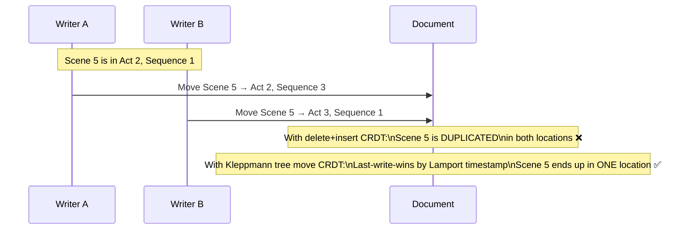
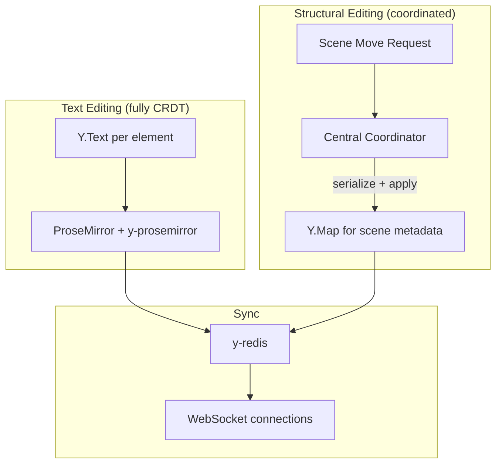
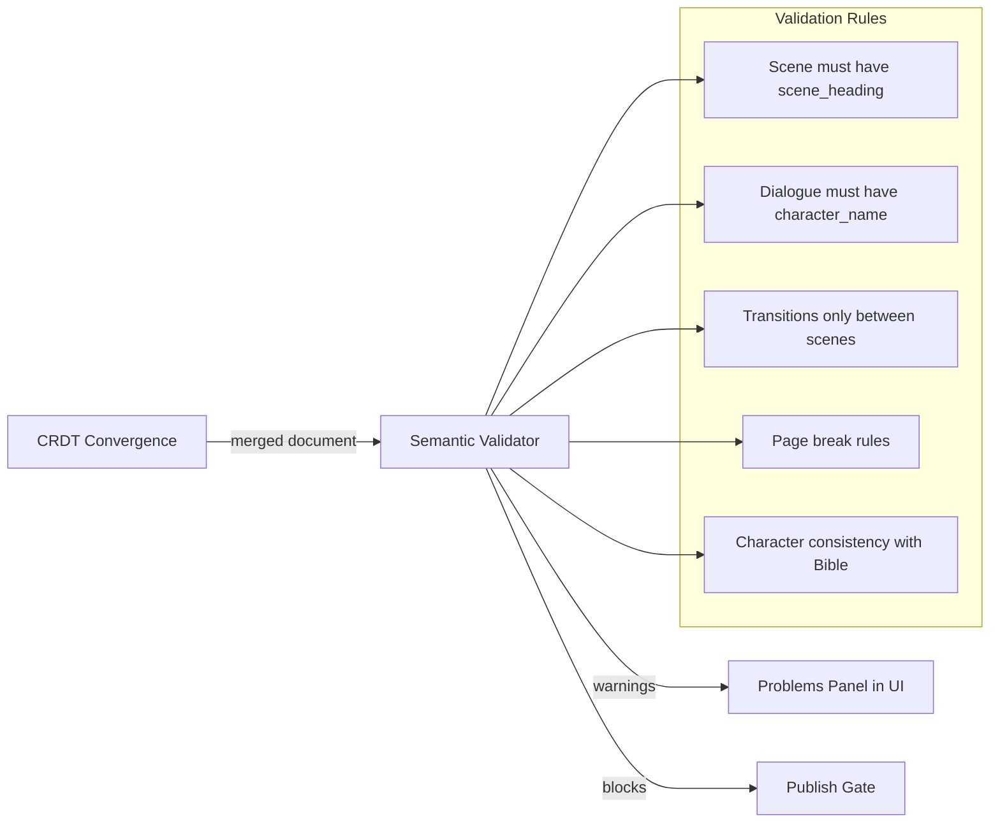
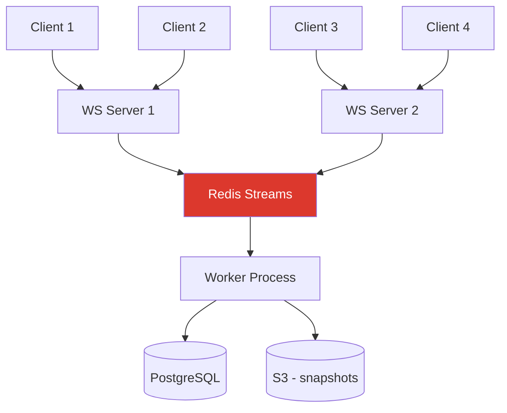

# 04 — CRDT & Collaboration Strategy

## The Problem

ScriptOS needs real-time collaboration for two fundamentally different operation types:

1. **Text editing** — inserting/deleting characters in dialogue, action blocks, etc.
2. **Structural editing** — moving scenes between sequences, splitting scenes, reordering beats, merging acts

CRDTs (Conflict-free Replicated Data Types) guarantee convergence without a central server, which is critical for offline-capable on-set tools. But tree-structured CRDTs for structural operations are significantly harder than text CRDTs.

## The Tree Move Problem

When two users concurrently move the same scene to different parents using naive delete+insert:



**Kleppmann's solution** (IEEE TPDS 2021): Unify create, delete, and move into a single `Move(timestamp, parent, metadata, child)` operation. Lamport timestamps provide global ordering. Formally verified in Isabelle/HOL.

## Library Comparison

| Feature | Loro | Yjs | Automerge 3.0 |
|---------|------|-----|----------------|
| **Rich text CRDT** | Peritext-compliant ✅ | Custom attributes (edge cases) | Peritext marks ✅ |
| **Tree move CRDT** | Native MovableTree ✅ | ❌ (delete+insert only) | ❌ |
| **Movable list** | Native MovableList ✅ | ❌ | ❌ |
| **ProseMirror binding** | Immature ⚠️ | Battle-tested ✅ | Available |
| **npm weekly downloads** | ~5K | 900K+ | ~50K |
| **Time travel / versioning** | Built-in ✅ | Manual snapshots | Built-in ✅ |
| **Performance** | Excellent (Rust core) | Excellent | Good |
| **Awareness/presence** | No built-in protocol ⚠️ | y-protocols ✅ | No |
| **Production maturity** | Early ⚠️ | Proven at scale ✅ | Growing |
| **License** | MIT | MIT | MIT |

## Recommended Approach: Loro Primary, Yjs Fallback

### Phase 1 — Proof of Concept (Week 1–4)

Build a minimal screenplay editor with Loro:
- LoroText per leaf element (dialogue line, action block)
- LoroTree for the Script AST structure
- Basic ProseMirror ↔ Loro binding
- Evaluate: is the binding stable enough for production?

### Phase 2 — Decision Gate

If Loro POC succeeds → proceed with Loro for full implementation.
If Loro POC reveals blocking issues → pivot to Yjs + TipTap with coordinated structural ops.

### Yjs Fallback Architecture



Under the Yjs fallback, structural operations (scene moves, splits, reorders) are **not** pure CRDT — they go through a lightweight central coordinator that serializes them. This prevents the duplication problem at the cost of requiring connectivity for structural edits. Text editing remains fully CRDT and works offline.

## Semantic Validation Layer

CRDTs guarantee convergence but NOT semantic validity. A merged document might contain:
- A scene with no slug line
- Dialogue without a character name
- Orphaned parentheticals

### Validation Architecture



**Key principle:** Validation is **debounced and incremental** — it runs after convergence settles, not during real-time editing. It produces warnings in a "Problems" panel (like VS Code), never blocks typing. Only the publish gate can hard-block on validation failures.

## Document Structure: One CRDT Per Element

**Never** use a single monolithic CRDT for the entire screenplay.

```
✅ Correct: Each leaf element has its own CRDT text
Scene 12
├── scene_heading  → LoroText("INT. COFFEE SHOP - DAY")
├── action_block   → LoroText("Jake enters, scanning the room...")
├── dialogue_group
│   ├── character   → LoroText("JAKE")
│   ├── parenthetical → LoroText("(sotto voce)")
│   └── dialogue    → LoroText("I need to find her.")
└── action_block   → LoroText("He spots MARIA at the counter.")

❌ Wrong: One big CRDT text for the whole script
Script → LoroText("INT. COFFEE SHOP - DAY\n\nJake enters...")
```

This prevents formatting from leaking across structural boundaries and allows independent CRDT histories per element.

## CRDT Sync Infrastructure: y-redis

For scaling CRDT sync beyond a single server:



**Key y-redis behaviors:**
- Server does NOT hold Y.Doc in memory after initial sync — streams updates through Redis
- Unlimited server instances behind a load balancer, no coordination needed
- Worker processes persist from Redis to durable storage
- **AGPL license** — commercial license required for proprietary use

## Tombstone and History Management

Screenplays under months of revision accumulate significant CRDT metadata:
- Deleted characters leave tombstones
- Move operations accumulate timestamps
- Version history grows linearly

**Mitigation:** Periodic compaction creating clean snapshots. Retain full history for the active revision; archive older revisions as immutable snapshots with compacted CRDT state.

## Open Questions

- [ ] Loro ProseMirror binding: build in-house or contribute upstream?
- [ ] Awareness protocol for Loro: build on top of WebSocket, or use y-protocols?
- [ ] Compaction frequency: per-session, daily, or on revision color change?
- [ ] Split/merge operations: decompose into atomic tree ops or custom CRDT op?
- [ ] Maximum concurrent editors: test at 10, 20, 50 — find practical limits
