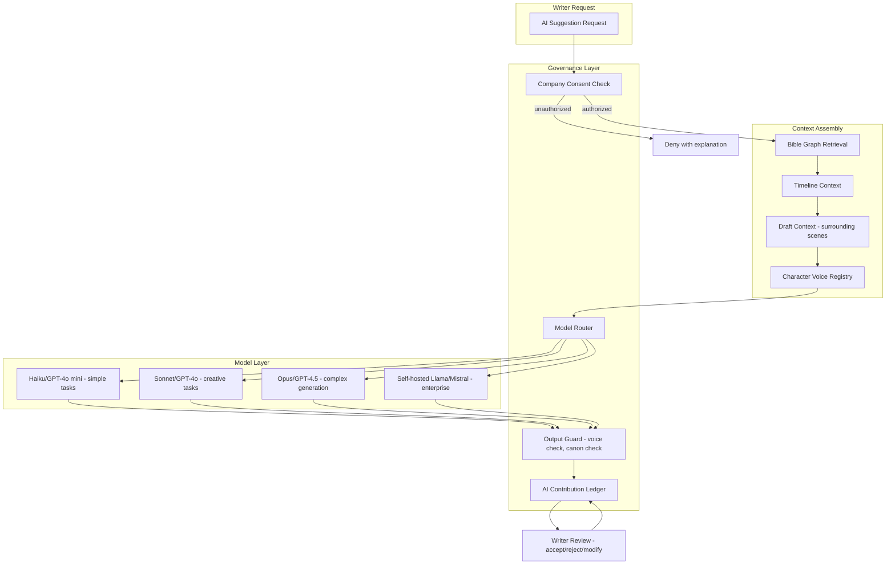
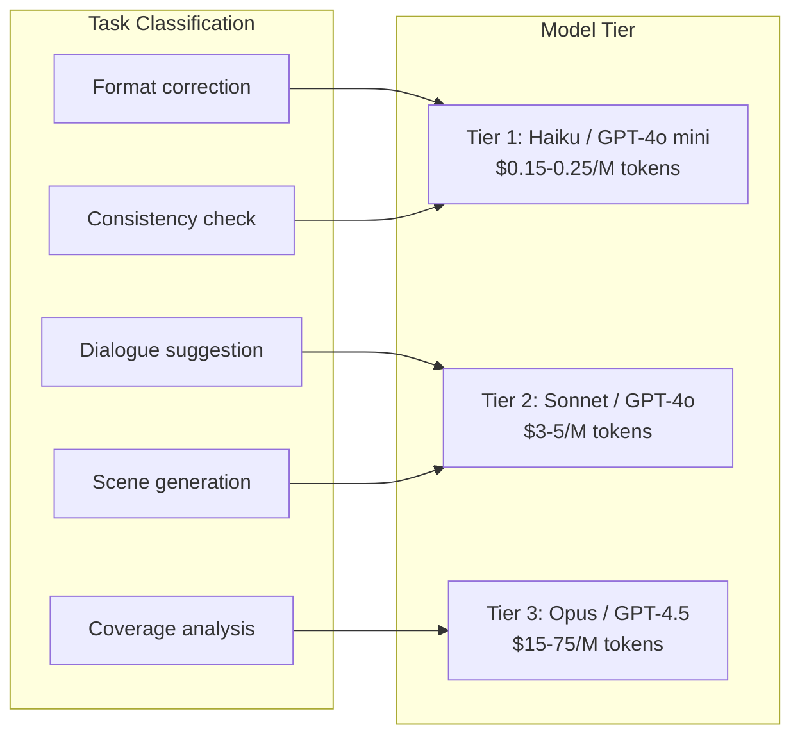

# 05 — AI Governance & Model Strategy

## Governing Principle

> AI is an assistant to the writer, never the author. Every AI interaction is logged, attributable, and compliant with WGA Article 72.

## WGA Article 72 — Key Rules

The 2023 WGA Minimum Basic Agreement (effective through May 1, 2026):

| Rule | Implication for ScriptOS |
|------|------------------------|
| AI is not a writer; AI output is not literary material | AI features must be positioned as assistive tools |
| Companies cannot require writers to use AI | AI must be opt-in, never mandatory in any workflow |
| Writers retain credit when voluntarily using AI with company consent | Must track company consent state per project |
| Companies must disclose AI origins of material given to writers | Inbound material provenance must be tracked |
| Semi-annual WGA meetings on AI use | Platform usage reports must be exportable |

### What ScriptOS CAN Offer

- AI as an assistive tool writers voluntarily use (with company consent)
- Non-generative AI: consistency checking, format validation, plagiarism detection
- Analytical AI: coverage analysis, structure analysis, pacing metrics
- Bible-grounded suggestions: dialogue alternatives, character voice checks

### What ScriptOS CANNOT Do

- Position AI as independently writing literary material
- Allow AI output to be labeled as source material
- Require writers to use AI features
- Train models on writers' scripts without explicit authorization

## AI Assistance Architecture



## AI Contribution Ledger

Every AI interaction is immutably logged:

```typescript
interface AILedgerEntry {
  id: string;
  timestamp: string;                    // ISO 8601
  user_id: string;                      // authenticated writer
  project_id: string;
  scene_id: string | null;
  interaction_type: AIInteractionType;
  model_id: string;                     // "claude-sonnet-4-20250514", etc.
  model_version: string;
  prompt_hash: string;                  // hash of assembled prompt (not stored verbatim for privacy)
  context_refs: string[];              // bible facts, scenes used for grounding
  ai_output: string;                   // exact AI response
  writer_action: 'accepted' | 'rejected' | 'modified';
  modification_delta: string | null;   // diff if modified
  company_consent_ref: string;         // reference to consent record
  created_at: string;
}

type AIInteractionType =
  | 'dialogue_suggestion'
  | 'action_description'
  | 'character_voice_check'
  | 'consistency_check'
  | 'structure_analysis'
  | 'coverage_analysis'
  | 'scene_description'
  | 'beat_expansion'
  | 'translation'
  | 'format_correction';
```

## Character Voice Registry

Each character in the Series Bible can have a voice profile that constrains AI suggestions:

```typescript
interface CharacterVoice {
  character_id: string;
  vocabulary_level: 'simple' | 'moderate' | 'sophisticated' | 'archaic';
  speech_patterns: string[];          // "uses rhetorical questions", "never contracts"
  forbidden_words: string[];          // words this character would never say
  reference_scenes: string[];         // exemplar scenes for few-shot prompting
  dialect_notes: string | null;
  emotional_range: string | null;     // "stoic, rarely shows anger openly"
  updated_by: string;
  updated_at: string;
}
```

AI suggestions for dialogue are checked against the voice registry before being shown to the writer. Violations produce warnings, not blocks.

## Model Routing Strategy



### Cost Optimization

| Technique | Savings | How |
|-----------|---------|-----|
| Prompt caching | ~90% on cached context | Bible + voice registry context is stable across requests; Anthropic cache hits: $0.30/M vs $3.00/M |
| Semantic caching | ~31% request reduction | Deduplicate near-identical queries across writers |
| Model routing | 50–70% vs all-premium | Cheap models for simple tasks |
| Batching | Variable | Non-urgent analyses batched off-peak |

### Per-Session Cost Estimate

A typical screenplay is ~33,000 tokens. A writing session involves 50–200 AI interactions.

| Scenario | Cost per session |
|----------|-----------------|
| Light use (format checks, consistency) | $0.10–0.30 |
| Moderate use (dialogue help, analysis) | $0.50–1.00 |
| Heavy use (scene drafting, coverage) | $1.00–2.00 |

## Deployment Approaches (Phased)

| Phase | Approach | Target |
|-------|----------|--------|
| Phase 1 (Launch) | API-based multi-model routing | All tiers |
| Phase 2 | Self-hosted Llama/Mistral on vLLM | Enterprise clients requiring data residency |
| Phase 3 | BYOK (Bring Your Own Key) adapter | Studios with existing AI vendor contracts |

## Content Provenance: C2PA Integration

Embed C2PA Content Credentials in exported script files to cryptographically prove:
- Authorship chain (which humans wrote which parts)
- AI involvement (which sections had AI assistance)
- Modification timestamps
- Company consent status

## Compliance Reporting

The platform must export:
- Per-project AI usage summary for WGA semi-annual meetings
- Per-writer AI interaction logs (anonymizable)
- Company consent audit trail
- Model provenance records (which models were available, which were used)

## Open Questions

- [ ] Prompt architecture: how to assemble Bible + Timeline + Draft context efficiently
- [ ] Voice registry: how many reference scenes per character for effective few-shot?
- [ ] Self-hosted models: which fine-tuned model for screenplay dialogue?
- [ ] C2PA: integration point — at PDF export? At FDX export? Both?
- [ ] Rate limiting: per-user, per-project, or per-organization?
