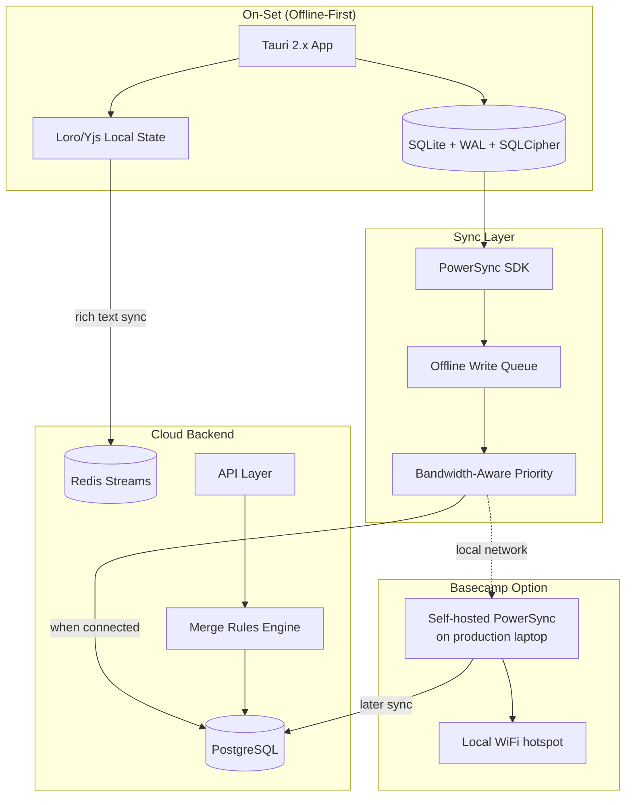
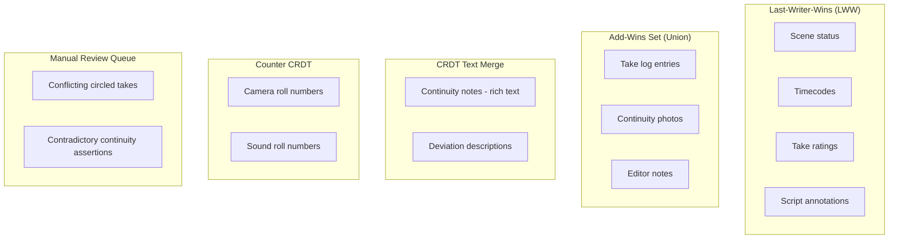
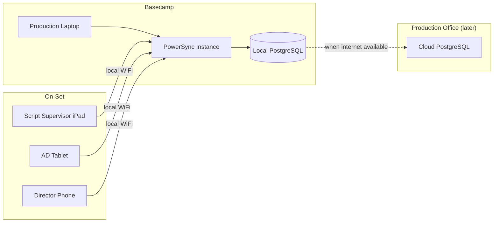

# 06 — Offline & On-Set Sync

## The Problem

Film sets have notoriously poor connectivity. Sound stages block signal, remote locations have no infrastructure, and shooting days run 12–16 hours. The Script Supervisor module must work **fully offline** and sync reliably when connectivity returns.

## Architecture Overview

## Technology Choices

| Component | Choice | Rationale |
|-----------|--------|-----------|
| Client runtime | Tauri 2.x | 3–10MB binary vs Electron 85–165MB; native SQLite; iOS/Android support |
| Local database | SQLite + WAL mode + SQLCipher | Crash-safe (survives battery death), encrypted at rest |
| Sync engine | PowerSync | Battle-tested Postgres↔SQLite sync; Sync Streams for role-based data control |
| Rich text sync | Loro/Yjs (same as collaboration layer) | CRDT merge for continuity notes and annotations |
| Encryption | SQLCipher | At-rest encryption for sensitive script data on device |

## Why PowerSync

PowerSync was built specifically for offline-first sync between Postgres and SQLite. The team has built sync technology since 2009 and has Fortune 500 field service deployments.

Key capabilities:
- **Automatic offline write queuing** with retry on reconnection
- **Sync Streams** controlling what data goes to which user role
- **SQL everywhere** — same queries work on SQLite (client) and Postgres (server)
- **Multi-platform SDKs** — React Native, Flutter, Web, Swift, Kotlin
- **Server-authoritative model** — production office is the final arbiter

## Conflict Resolution by Data Type

| Data Type | CRDT Strategy | Rationale |
|-----------|--------------|-----------|
| Scene status, timecodes, ratings | Last-Writer-Wins register | Latest correction is authoritative |
| Take log entries, photos | Add-wins set (union) | Never lose a logged take |
| Continuity notes (rich text) | Loro/Yjs text CRDT | Character-level merge |
| Camera/sound roll numbers | Counter CRDT | Only increment, never lose count |
| Script annotations | LWW per object | Each annotation is independent |
| Conflicting circled takes | Manual review queue | Human judgment required |

## Role-Based Sync Streams

Not every role needs all data. PowerSync Sync Streams control data per role:

| Role | Receives | Sends |
|------|----------|-------|
| Script Supervisor | Everything for assigned episodes | Takes, deviations, continuity photos, notes |
| 1st AD | Scene status, schedule, call sheet data | Scene completion status |
| Camera Department | Camera reports, slate info | Camera roll metadata |
| Sound Department | Sound reports | Sound roll metadata |
| Director | Circled takes, supervisor notes | Director's notes |
| Editorial | Circled takes, lined script, facing pages | — (read-only) |

## Typical On-Set Data Volume

A shooting day generates surprisingly little structured data:

| Data Type | Volume per Day | Size |
|-----------|---------------|------|
| Take logs | 100–500 entries | 50–200 KB |
| Annotations | 50–200 entries | 20–100 KB |
| Continuity photos | 50–300 photos | 50–300 MB (media) |
| Deviations | 10–50 entries | 5–25 KB |
| Lined script marks | 20–80 entries | 10–40 KB |

Structured data is trivially small for SQLite. **Photos are the bandwidth challenge** — prioritize structured data sync first, photos sync opportunistically.

## Crash Recovery

On-set devices die from battery exhaustion regularly. The architecture must survive ungraceful shutdowns:

- **SQLite WAL mode** ensures atomic writes — partially written transactions are rolled back on restart
- **SQLCipher** encryption is block-level — corruption of one block doesn't destroy the database
- **PowerSync** offline queue is persisted to SQLite — survives restart
- **CRDT state** is persisted to local storage independently of network state

## Basecamp Local Sync

For remote locations with no internet, deploy a self-hosted PowerSync instance on a production laptop at basecamp:

This provides local WiFi sync without internet. When the basecamp laptop eventually connects to the internet, it syncs to the cloud backend.

## Open Questions

- [ ] PowerSync licensing and pricing for self-hosted basecamp deployments
- [ ] Photo sync strategy: compress on-device before sync, or sync originals?
- [ ] Tauri 2.x iOS maturity: is it production-ready, or should iOS be React Native?
- [ ] SQLCipher key management: device keychain, user password, or organization key?
- [ ] Maximum offline duration to test: 24 hours? 72 hours? Full remote shoot week?
