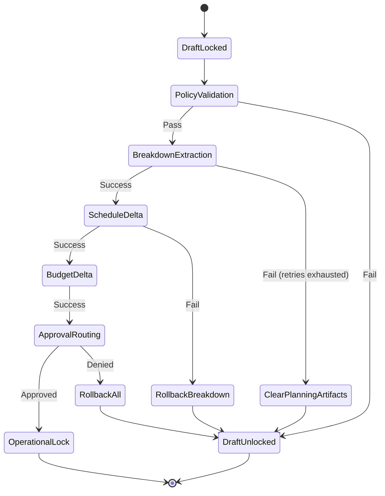
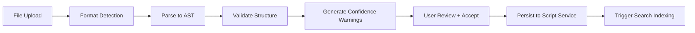

# 07 — Workflow Orchestration

## Why Orchestration, Not Application State Machines

Production workflows are long-running (hours to weeks), approval-bound, and require compensation logic on failure. Encoding these as application-level state machines leads to:
- Lost state on service restarts
- No visibility into in-flight workflows
- Ad-hoc compensation that misses edge cases
- Impossible debugging of stuck approvals

**Temporal** provides durable execution — workflows survive service restarts, infrastructure failures, and can run for weeks while waiting for human approvals.

## Publish-to-Production Saga

The primary orchestrated workflow. Publishing a production draft is not a single event — it's a saga.



### Saga Steps

| Step | Service | Success Action | Failure Handling |
|------|---------|---------------|-----------------|
| 1. Lock draft | Script Service | Set draft status to `publishing` | Reject if unresolved merge or canon violations |
| 2. Policy validation | Compliance + Legal | Verify AI disclosure, rights, NDA conditions | Block publish, surface violations to user |
| 3. Breakdown extraction | Breakdown Service | Generate/update breakdown from AST | Retryable (3x); on exhaust, compensate by clearing generated artifacts |
| 4. Schedule delta | Scheduling Service | Recompute affected schedule items | Rollback breakdown version |
| 5. Budget delta | Budgeting Service | Recalculate affected budget lines | Rollback schedule + breakdown versions |
| 6. Approval routing | Workflow + Notifications | Route to department heads, producers | If denied, rollback all derived versions |
| 7. Operational lock | Script Service | Lock version, notify all stakeholders | Final lock only after full approval chain completes |

## Other Orchestrated Workflows

### Import Saga



### Call Sheet Generation

```mermaid
flowchart LR
    TRIGGER[Schedule Change / Manual Trigger]
    TRIGGER --> PULL_SCENES[Pull scenes for shoot day]
    PULL_SCENES --> PULL_CAST[Pull cast + availability]
    PULL_CAST --> PULL_CREW[Pull crew assignments]
    PULL_CREW --> PULL_LOGISTICS[Pull locations + transport]
    PULL_LOGISTICS --> GENERATE[Generate call sheet]
    GENERATE --> APPROVE[AD / UPM approval]
    APPROVE --> DISTRIBUTE[Distribute to crew]
```



### Revision Distribution

When a new revision color is published:
1. Lock previous revision
2. Generate diff against previous version
3. Create revision-colored pages (PDF)
4. Distribute to stakeholders based on access controls
5. Update breakdown for changed scenes
6. Log in audit trail

## Temporal Configuration

```yaml
# Workflow timeouts
publish_saga:
  execution_timeout: 72h          # max time for full saga including approvals
  activity_timeout: 5m            # max time per automated step
  approval_timeout: 48h           # max time waiting for human approval
  retry_policy:
    initial_interval: 1s
    backoff_coefficient: 2.0
    maximum_attempts: 3
    non_retryable_errors:
      - PolicyViolationError
      - CanonConflictError
```

## Event Fan-Out (Non-Orchestrated)

Not everything needs orchestration. Use event-driven fan-out for:

| Event | Consumers |
|-------|-----------|
| `ScriptCheckpointed` | Search indexer, notification service |
| `SceneModified` | Continuity service, bible conflict checker |
| `TakeLogged` | Editorial turnover queue, dailies sync |
| `ApprovalCompleted` | Notification service, audit log |
| `UserJoinedSession` | Presence service, collaboration metrics |

**Rule of thumb:** If it needs compensation logic or human approval → orchestrate with Temporal. If it's fire-and-forget or idempotent → event fan-out.

## Open Questions

- [ ] Temporal deployment: Temporal Cloud vs self-hosted?
- [ ] Approval routing: configurable per-organization or hardcoded workflows?
- [ ] Escalation policies: auto-approve after timeout, or escalate to next level?
- [ ] Multi-department approval: sequential or parallel?
- [ ] Saga visibility: expose Temporal workflow status in UI, or abstract behind custom status?
