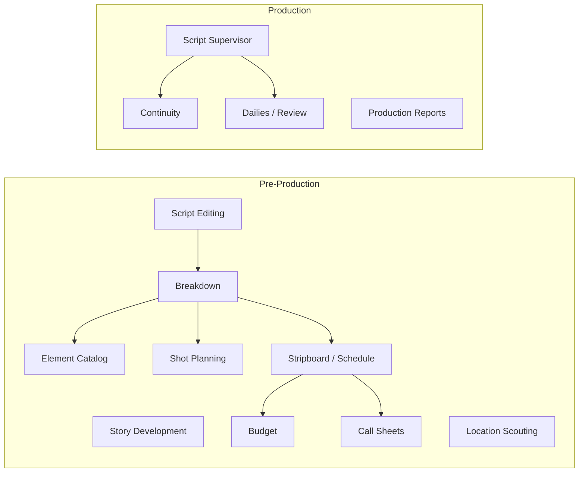
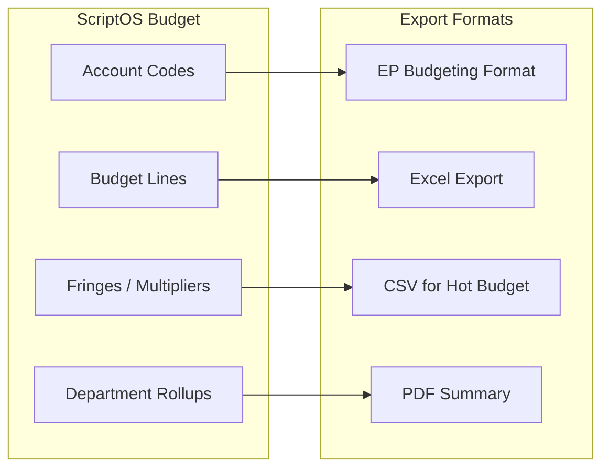
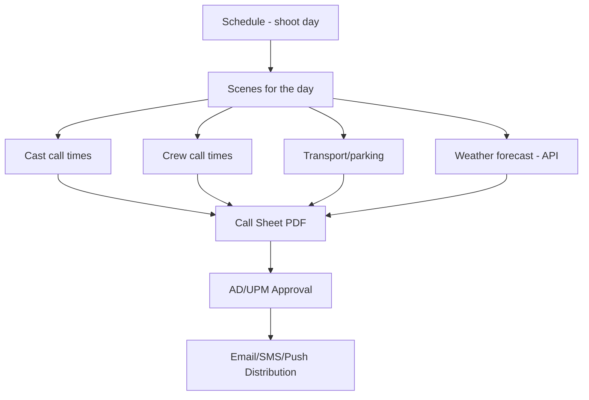

# 08 — Pre-Production & Production Modules

## Module Overview



## Story Development Layer

TV writing starts upstream of the screenplay editor.

| Module | Primary Objects | Key Outputs |
|--------|----------------|-------------|
| Beat board | Cards, tags, dependencies, attachments | Episode structure, sequence planning, pitch room collaboration |
| Outline | Acts, sequences, planned scenes | Script skeleton generation, review-ready story docs |
| Arc mapping | Character arcs, season arcs, payoff links | Bible updates, continuity expectations, story-day dependencies |
| Series Bible | Rules, facts, lore, style guides | Canon grounding, contradiction alerts, AI retrieval context |

## Breakdown Service

Auto-detects elements from the Script AST and allows manual tagging.

### Breakdown Categories (Industry Standard — 15 categories)

| # | Category | Color Code | Auto-Detection |
|---|----------|-----------|----------------|
| 1 | Cast Members | Red | Character names from dialogue groups |
| 2 | Extras / Background | Orange | Action block NLP — "crowd", "bystanders" |
| 3 | Stunts | Yellow | Action block NLP — "falls", "fight", "explosion" |
| 4 | Special Effects | Blue | Action block NLP — "rain", "fire", "wind" |
| 5 | Props | Violet | Action block NLP — object nouns interacted with |
| 6 | Vehicles | Pink | Action block NLP — "car", "truck", "helicopter" |
| 7 | Animals | Red-Orange | Action block NLP — animal nouns |
| 8 | Wardrobe | Circle | Character + scene context |
| 9 | Makeup / Hair | Asterisk | Character + scene context |
| 10 | Sound Effects | Brown | Action block NLP — "gunshot", "thunder" |
| 11 | Music | Purple | Action block NLP — "plays guitar", "song" |
| 12 | Special Equipment | Box | Action block NLP — "crane", "underwater" |
| 13 | Production Notes | — | Manual only |
| 14 | Set Dressing | Green | Location + scene context |
| 15 | Greenery | — | Location + scene context |

Auto-detection uses NLP on action blocks + character/location cross-reference from the Bible Graph. All auto-detections are flagged with confidence scores for human review.

## Scheduling (Stripboard)

Scheduling takes breakdown data and produces a shooting schedule optimized for:
- Actor availability and consecutive days
- Location grouping (minimize company moves)
- Day/night shooting balance
- Child actor hour restrictions
- Union rules (turnaround time, meal penalties)

### Schedule ↔ Script Linkage

```typescript
interface ShootDay {
  id: string;
  day_number: number;
  date: string;                      // actual calendar date
  scenes: ScheduledScene[];
  location_id: string;
  unit: 'main' | 'second' | 'splinter';
  day_night: 'day' | 'night';
  estimated_pages: number;           // eighths of a page
  notes: string;
}

interface ScheduledScene {
  scene_id: string;                  // → Script AST scene ID
  breakdown_id: string;              // → Breakdown record
  estimated_duration: number;        // minutes
  cast_ids: string[];
  setup_count: number;
}
```

## Budgeting

Budget versions are linked to specific schedule + breakdown versions.

### Budget ↔ Accounting Bridge



### Accounting Control Areas

| Area | What Is Tracked | Why It Matters |
|------|----------------|----------------|
| Rights tags | Territory, clearance state, approved recipients | Controls asset sharing |
| NDA gates | Acceptance status tied to recipient identity | Prevents unsecured distribution |
| Release tracking | Talent, location, likeness, scene-linked | Legal and production readiness |
| Legal hold | Project/version hold flags with reason codes | Preserves artifacts under dispute |
| Accounting mappings | Accounts, fringes, units, department templates | Bridges to real production accounting |

## Script Supervisor On-Set Module

The most differentiated production module. Captures what **actually happened** on set.

### Core Data Objects

```typescript
interface TakeLog {
  id: string;
  scene_id: string;
  setup_id: string;
  take_number: number;
  slate: string;                     // "12A"
  timecode_in: string;               // "01:23:45:12"
  timecode_out: string;
  duration: number;                  // seconds
  printed: boolean;                  // sent to editorial
  circled: boolean;                  // director's preferred
  camera_rolls: string[];
  sound_rolls: string[];
  notes_to_editor: string | null;
  deviations: LineDeviation[];
  continuity_photos: string[];       // media references
}

interface LineDeviation {
  id: string;
  take_id: string;
  line_span: { start_element_id: string; end_element_id: string };
  type: 'dropped_line' | 'ad_lib' | 'reordered' | 'paraphrased';
  description: string;
  as_performed_text: string | null;
}
```

### Daily Turnover Package

At wrap, the Script Supervisor generates:

| Output | Format | Consumer |
|--------|--------|----------|
| Lined script | PDF | Editorial |
| Facing pages | PDF | Editorial |
| Take metadata | ALE + CSV + JSON | Avid / Resolve / custom |
| Continuity photos | Tagged media files | All departments |
| Editor's daily report | PDF | Post supervisor |
| Script supervisor daily report | PDF | Production office |

## Call Sheet Generation

Call sheets are generated from schedule data + crew/cast assignments.



## Decisions

**Stripboard scheduling solver — Google OR-Tools (open source constraint solver). See ADR-021.**
Scheduling is a constraint satisfaction problem. Building a solver from scratch is a research project. Google OR-Tools is a proven, production-grade constraint solver (Apache 2.0 license) used in logistics and scheduling at scale. OR-Tools handles: actor availability windows, location grouping (minimize company moves), day/night balance, child actor hour restrictions, and union turnaround rules. The Scheduling Service wraps OR-Tools — engineers write constraints in the OR-Tools API, not a custom solver. Manual override is always available; the solver produces a starting point that the 1st AD refines.

**Budget templates at launch — 3 templates: Feature Film, TV Episode, Indie/Low Budget.**
Three templates cover ~80% of productions. Feature Film follows AICP-standard account codes. TV Episode uses standard 8-act structure with per-episode rollups. Indie/Low Budget is a simplified version without union fringe calculations. Additional templates (documentary, commercial, animation, music video) added in v1.1 based on user feedback. Over-building templates before having real user data creates templates nobody uses.

**Script Supervisor UX — desktop-first (macOS) at launch.**
Script Supervisors on professional productions use a laptop on set — more screen real estate for lined scripts, facing pages, and multi-column notes. iPad is preferred for walkabout use (checking props, visiting set dressing) but the primary workflow is desk-based. Desktop launches first. iPad support evaluated alongside Tauri iOS maturity in Q3 2026. This is consistent with the Tauri iOS decision in wiki/06.

**Call sheet distribution — email (PDF attachment) + in-app push notification at launch; SMS in v1.1.**
Email with PDF attachment is universal — all crew have email and can receive the call sheet even without the app. In-app notification provides an interactive confirmation flow ("I've received tomorrow's call sheet"). SMS adds cost (carrier fees) and phone number management complexity (international numbers, do-not-call compliance). Defer SMS to v1.1 when we understand which user segments want it. Mobile deep link in the in-app notification opens the call sheet directly in the app.

**Production reports at launch — Daily Production Report (DPR), Script Supervisor Daily, Editor's Daily.**
DPR is universal — every production requires it, and it is generated from data we already capture (scenes shot, pages, setups, cast, schedule status). Script Supervisor Daily Report and Editor's Daily Report are generated from TakeLog data the Script Supervisor module captures. AICP reports and day-out-of-days reports require additional data collection points and are deferred to v1.1.
