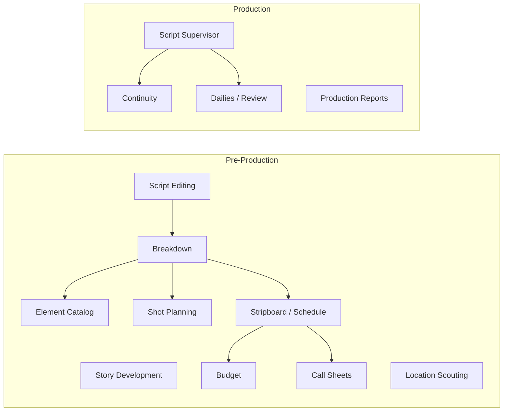
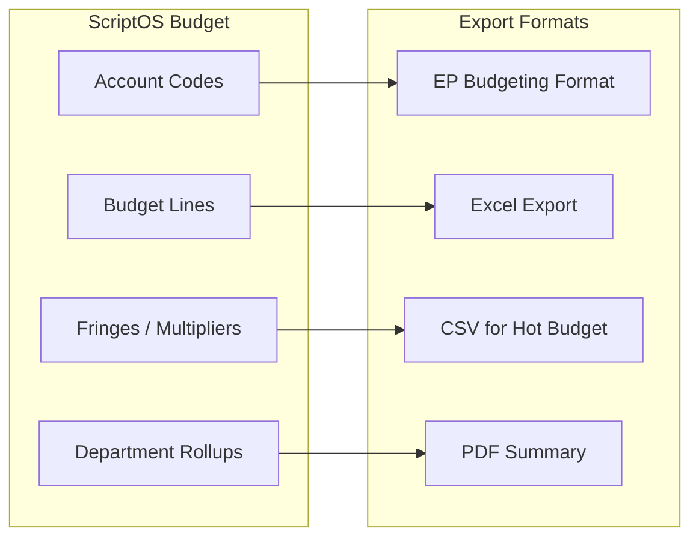
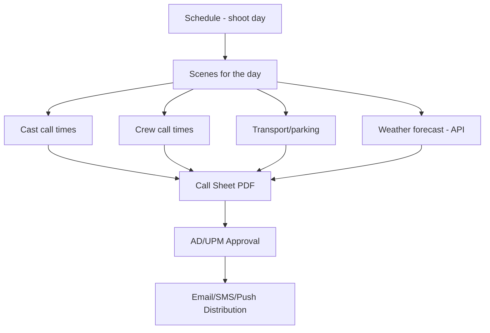

# 08 — Pre-Production & Production Modules

## Module Overview



## Story Development Layer

TV writing starts upstream of the screenplay editor.

| Module | Primary Objects | Key Outputs |
|--------|----------------|-------------|
| Beat board | Cards, tags, dependencies, attachments | Episode structure, sequence planning, pitch room collaboration |
| Outline | Acts, sequences, planned scenes | Script skeleton generation, review-ready story docs |
| Arc mapping | Character arcs, season arcs, payoff links | Bible updates, continuity expectations, story-day dependencies |
| Series Bible | Rules, facts, lore, style guides | Canon grounding, contradiction alerts, AI retrieval context |

## Breakdown Service

Auto-detects elements from the Script AST and allows manual tagging.

### Breakdown Categories (Industry Standard — 15 categories)

| # | Category | Color Code | Auto-Detection |
|---|----------|-----------|----------------|
| 1 | Cast Members | Red | Character names from dialogue groups |
| 2 | Extras / Background | Orange | Action block NLP — "crowd", "bystanders" |
| 3 | Stunts | Yellow | Action block NLP — "falls", "fight", "explosion" |
| 4 | Special Effects | Blue | Action block NLP — "rain", "fire", "wind" |
| 5 | Props | Violet | Action block NLP — object nouns interacted with |
| 6 | Vehicles | Pink | Action block NLP — "car", "truck", "helicopter" |
| 7 | Animals | Red-Orange | Action block NLP — animal nouns |
| 8 | Wardrobe | Circle | Character + scene context |
| 9 | Makeup / Hair | Asterisk | Character + scene context |
| 10 | Sound Effects | Brown | Action block NLP — "gunshot", "thunder" |
| 11 | Music | Purple | Action block NLP — "plays guitar", "song" |
| 12 | Special Equipment | Box | Action block NLP — "crane", "underwater" |
| 13 | Production Notes | — | Manual only |
| 14 | Set Dressing | Green | Location + scene context |
| 15 | Greenery | — | Location + scene context |

Auto-detection uses NLP on action blocks + character/location cross-reference from the Bible Graph. All auto-detections are flagged with confidence scores for human review.

## Scheduling (Stripboard)

Scheduling takes breakdown data and produces a shooting schedule optimized for:
- Actor availability and consecutive days
- Location grouping (minimize company moves)
- Day/night shooting balance
- Child actor hour restrictions
- Union rules (turnaround time, meal penalties)

### Schedule ↔ Script Linkage

```typescript
interface ShootDay {
  id: string;
  day_number: number;
  date: string;                      // actual calendar date
  scenes: ScheduledScene[];
  location_id: string;
  unit: 'main' | 'second' | 'splinter';
  day_night: 'day' | 'night';
  estimated_pages: number;           // eighths of a page
  notes: string;
}

interface ScheduledScene {
  scene_id: string;                  // → Script AST scene ID
  breakdown_id: string;              // → Breakdown record
  estimated_duration: number;        // minutes
  cast_ids: string[];
  setup_count: number;
}
```

## Budgeting

Budget versions are linked to specific schedule + breakdown versions.

### Budget ↔ Accounting Bridge



### Accounting Control Areas

| Area | What Is Tracked | Why It Matters |
|------|----------------|----------------|
| Rights tags | Territory, clearance state, approved recipients | Controls asset sharing |
| NDA gates | Acceptance status tied to recipient identity | Prevents unsecured distribution |
| Release tracking | Talent, location, likeness, scene-linked | Legal and production readiness |
| Legal hold | Project/version hold flags with reason codes | Preserves artifacts under dispute |
| Accounting mappings | Accounts, fringes, units, department templates | Bridges to real production accounting |

## Script Supervisor On-Set Module

The most differentiated production module. Captures what **actually happened** on set.

### Core Data Objects

```typescript
interface TakeLog {
  id: string;
  scene_id: string;
  setup_id: string;
  take_number: number;
  slate: string;                     // "12A"
  timecode_in: string;               // "01:23:45:12"
  timecode_out: string;
  duration: number;                  // seconds
  printed: boolean;                  // sent to editorial
  circled: boolean;                  // director's preferred
  camera_rolls: string[];
  sound_rolls: string[];
  notes_to_editor: string | null;
  deviations: LineDeviation[];
  continuity_photos: string[];       // media references
}

interface LineDeviation {
  id: string;
  take_id: string;
  line_span: { start_element_id: string; end_element_id: string };
  type: 'dropped_line' | 'ad_lib' | 'reordered' | 'paraphrased';
  description: string;
  as_performed_text: string | null;
}
```

### Daily Turnover Package

At wrap, the Script Supervisor generates:

| Output | Format | Consumer |
|--------|--------|----------|
| Lined script | PDF | Editorial |
| Facing pages | PDF | Editorial |
| Take metadata | ALE + CSV + JSON | Avid / Resolve / custom |
| Continuity photos | Tagged media files | All departments |
| Editor's daily report | PDF | Post supervisor |
| Script supervisor daily report | PDF | Production office |

## Call Sheet Generation

Call sheets are generated from schedule data + crew/cast assignments.



## Open Questions

- [ ] Stripboard algorithm: build in-house or integrate existing solver?
- [ ] Budget templates: how many industry-standard templates to ship at launch?
- [ ] Script Supervisor: iPad-first or desktop-first for on-set UX?
- [ ] Call sheet distribution: email-only or in-app notification + mobile deep link?
- [ ] Production reports: which standard templates (AICP, studio-specific)?
