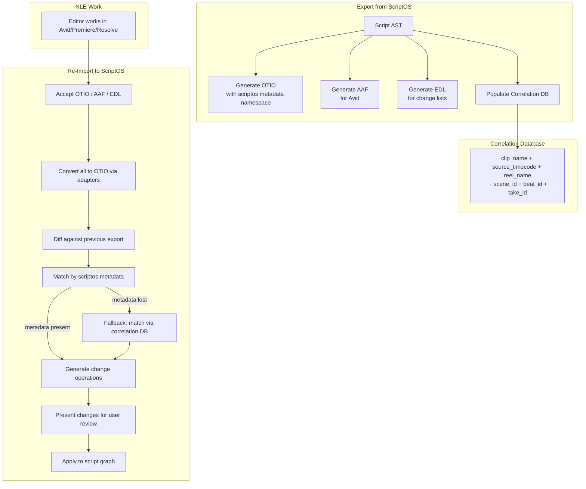
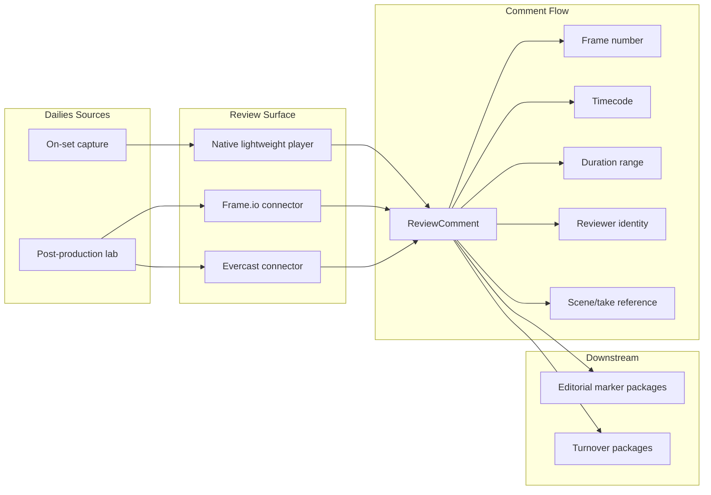

# 09 — Post-Production & Editorial Round-Trip

## The Problem

Exporting to NLEs is straightforward. The hard part is receiving changes **back** from editorial — scene reorders, omissions, new takes — and mapping them to the script graph. Metadata evaporation (NLEs stripping custom metadata) is the primary risk.

## What Survives NLE Round-Trip

| Data | Survives? | Notes |
|------|-----------|-------|
| Timecodes | ✅ Always | Universal across all formats |
| Reel/tape names | ✅ Always | 8-char limit in EDL |
| Basic edit structure | ✅ Always | Cuts, dissolves, track layout |
| Custom metadata keys | ⚠️ Sometimes | NLE-dependent; often stripped |
| Script references | ❌ Usually lost | No NLE preserves arbitrary pipeline metadata |
| Effects/speed changes | ❌ Format-dependent | Complex constructs don't survive interchange |

## Interchange Format Comparison

| Format | Best For | Limitations |
|--------|----------|-------------|
| **OTIO** | Universal interchange; Resolve, Avid (via adapter), FCP | No built-in diff; complex effects lost |
| **AAF** | Avid workflows (required) | Binary format; Avid-specific extensions |
| **FCPXML** | Final Cut Pro workflows | Avid can't import; Premiere support limited |
| **EDL** | Universal compatibility, change lists | Single-track, 8-char reel names, no rich metadata |
| **ALE** | Avid metadata sync | Metadata only — no timeline structure |

## Bidirectional Architecture



## Correlation Database

The fallback matching system. Three identifiers survive **all** interchange formats, even legacy EDL:

```typescript
interface CorrelationRecord {
  // Matching keys (survive all formats)
  clip_name: string;
  source_timecode_in: string;
  reel_name: string;

  // ScriptOS references
  scene_id: string;
  beat_id: string;
  take_id: string;
  script_version: string;
  export_id: string;             // which export batch
  exported_at: string;
}
```

## Change Detection Operations

After diffing the re-imported OTIO against the previously exported version:

| Change Detected | Script Graph Operation |
|-----------------|----------------------|
| Clips from scene removed | Scene status → `omitted` |
| Clips reordered | Scene order updated |
| New clips from untracked source | Flagged for manual mapping |
| Source range changed | Beat-level timing adjustment |
| Different source clip for same scene | Take selection changed |

## Dailies Review Integration



### ReviewComment Entity

```typescript
interface ReviewComment {
  id: string;
  frame: number;
  timecode: string;
  duration_range: { in: string; out: string } | null;
  reviewer_id: string;
  reviewer_name: string;
  comment_text: string;
  scene_ref: string | null;       // → Script AST scene ID
  take_ref: string | null;        // → TakeLog ID
  status: 'open' | 'addressed' | 'resolved';
  created_at: string;
}
```

## VFX Tracking Integration

Export structured metadata to VFX tracking systems:

| Integration | Format | Data Exchanged |
|-------------|--------|---------------|
| ShotGrid | REST API | Shots, tasks, versions, notes |
| ftrack | REST API | Shots, tasks, status, assignments |
| Custom pipeline | OTIO + JSON sidecar | Shot metadata, script references |

## Implementation Phases

| Phase | Deliverable | Dependencies |
|-------|-------------|-------------|
| Phase 1 | Export-only: OTIO + AAF + EDL + correlation DB | Script AST, Breakdown |
| Phase 2 | Import + diff + manual approval workflow | Phase 1, Workflow Orchestration |
| Phase 3 | Automated change propagation with webhook notifications | Phase 2, Event Bus |
| Phase 4 | NLE panel plugins (Premiere, Resolve) | Phase 3, client SDK |

## Open Questions

- [ ] Which NLEs to prioritize for round-trip: Avid? Premiere? Resolve?
- [ ] Dailies review: build native player or integrate Frame.io first?
- [ ] Change detection: file watching on shared storage vs manual export workflow?
- [ ] VFX integration: ShotGrid or ftrack first?
- [ ] OTIO adapter customization: contribute upstream or maintain fork?
