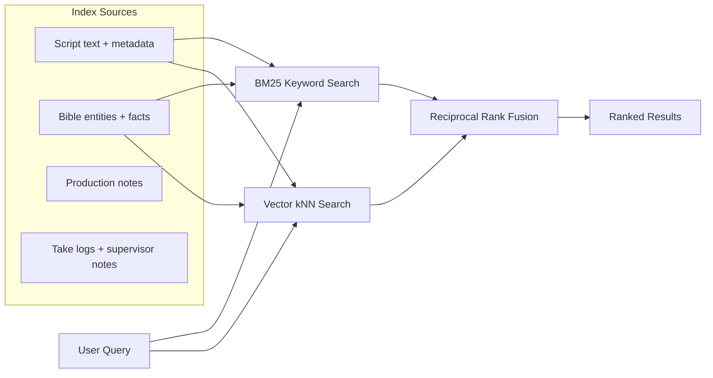
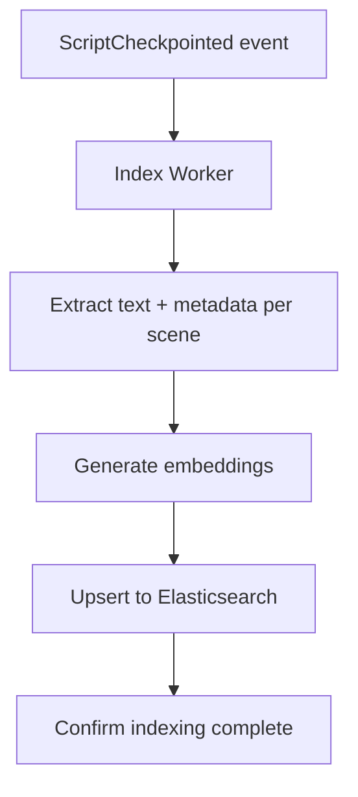

# 10 — Search & Hybrid Retrieval

## Architecture

Search combines keyword retrieval (BM25) for explicit tags and identifiers with semantic retrieval (vector kNN) for tone, intent, and scene similarity. Rankings are fused with Reciprocal Rank Fusion (RRF).

## Technology Choice: Elasticsearch 8.9+

Elasticsearch provides native RRF combining BM25 and dense vector kNN search since version 8.9 — no separate vector database needed.

| Feature | Elasticsearch | Separate Vector DB (Pinecone, etc.) |
|---------|--------------|-------------------------------------|
| BM25 keyword search | ✅ Native | ❌ Not available |
| Vector kNN search | ✅ Native (8.9+) | ✅ Specialized |
| RRF fusion | ✅ Built-in | ❌ Must implement |
| Operational complexity | One system | Two systems to maintain |
| Scale threshold | Sufficient up to 100M+ vectors | Better beyond 100M+ vectors |

For ScriptOS's scale (even 10,000 screenplays with embeddings ≈ 10–20GB), Elasticsearch is more than sufficient. A separate vector database only makes sense at 100M+ vectors.

### Index Refresh Latency

Default refresh interval: **1 second** (near-real-time). Configurable per-index based on freshness requirements:

| Index | Refresh Interval | Rationale |
|-------|-----------------|-----------|
| Scripts | 1s | Writers expect near-instant search results |
| Bible entities | 1s | Canon lookups must be current |
| Production data | 5s | Slightly less time-sensitive |
| Analytics/metrics | 30s | Batch-oriented queries |

## Embedding Strategy

| Content Type | Embedding Model | Dimensions |
|-------------|----------------|------------|
| Scene text | Voyage-3 or text-embedding-3-large | 1024 |
| Bible facts | Same as above | 1024 |
| Character voice samples | Same (or fine-tuned) | 1024 |

## Search Use Cases

| Use Case | Search Type | Example |
|----------|-------------|---------|
| Find scene by character name | BM25 keyword | "JAKE" → exact match |
| Find scenes with similar tone | Vector semantic | "tense confrontation" → similar scenes |
| Find continuity references | Hybrid BM25 + vector | "Jake's hand injury" → script + bible |
| Find scenes at location | BM25 faceted | INT_EXT:INT AND location:"coffee shop" |
| Bible contradiction check | Vector similarity | New fact → find contradicting existing facts |

## Indexing Pipeline

## Decisions

**Embedding model — OpenAI `text-embedding-3-large` (1536 dimensions) at launch. See ADR-024.**
`text-embedding-3-large` leads MTEB retrieval benchmarks and is already in use by teams in the OpenAI ecosystem. At ScriptOS's scale (even 10,000 screenplays), the cost difference between Voyage-3 and OpenAI embeddings is negligible. Simplicity wins — one AI vendor relationship for generation (Anthropic) and one for embeddings (OpenAI) is manageable; adding Voyage as a third vendor is not justified by marginal quality gains. Enterprise data-residency deployments use self-hosted `BGE-M3` or `e5-large-v2` served via a vLLM embedding endpoint (OpenAI-compatible API — no code changes required).

**Bible facts index — separate index (`scriptos-bible`), not inline with scenes.**
Bible facts and scenes have different search profiles. "Find all facts about Jake" is a structured entity query with optional semantic ranking. "Find scenes where Jake shows vulnerability" is a purely semantic query on scene text. Mixing them in one index degrades relevance for both — the retrieval signals conflict. The `scriptos-bible` index stores facts by entity ID, category, statement text, and embedding. Cross-index queries (find scenes that contradict a bible fact) join at the application layer after separate retrievals.

**Search scope — per-project default; cross-project opt-in at org level.**
Default scope is one project — a writer on Project A should not see Project B's content without authorization. Cross-project search is available as an org-admin-enabled feature for showrunners managing multiple seasons or related projects (e.g., comparing dialogue across a franchise). The Elasticsearch query always includes a `project_id` filter; cross-project mode substitutes an `org_id` filter with an explicit allowlist of project IDs the user has access to.

**Character name fuzzy matching — normalize to canonical ID at index time via Bible Graph aliases.**
Fuzzy string matching (Levenshtein, trigrams) is expensive and produces false positives ("JAKE" matching "JAKE SR.", "JAKE (V.O.)" as separate entities). The Bible Graph already maintains an `aliases` array per Character node (populated during script parsing and manual curation). At index time, the character resolver maps any name variant to the canonical character UUID. Search uses the canonical ID as a structured filter — exact match, not fuzzy. New unresolved character names are flagged for the writer to link to an existing character or create a new one.
