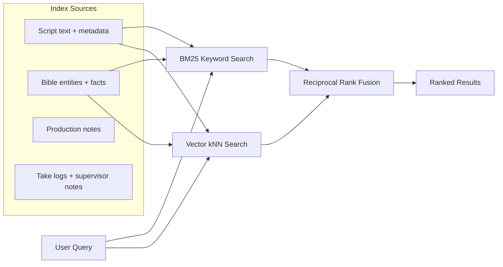
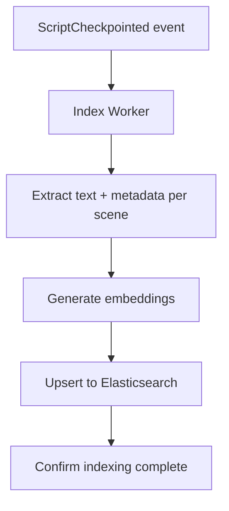

# 10 — Search & Hybrid Retrieval

## Architecture

Search combines keyword retrieval (BM25) for explicit tags and identifiers with semantic retrieval (vector kNN) for tone, intent, and scene similarity. Rankings are fused with Reciprocal Rank Fusion (RRF).

## Technology Choice: Elasticsearch 8.9+

Elasticsearch provides native RRF combining BM25 and dense vector kNN search since version 8.9 — no separate vector database needed.

| Feature | Elasticsearch | Separate Vector DB (Pinecone, etc.) |
|---------|--------------|-------------------------------------|
| BM25 keyword search | ✅ Native | ❌ Not available |
| Vector kNN search | ✅ Native (8.9+) | ✅ Specialized |
| RRF fusion | ✅ Built-in | ❌ Must implement |
| Operational complexity | One system | Two systems to maintain |
| Scale threshold | Sufficient up to 100M+ vectors | Better beyond 100M+ vectors |

For ScriptOS's scale (even 10,000 screenplays with embeddings ≈ 10–20GB), Elasticsearch is more than sufficient. A separate vector database only makes sense at 100M+ vectors.

### Index Refresh Latency

Default refresh interval: **1 second** (near-real-time). Configurable per-index based on freshness requirements:

| Index | Refresh Interval | Rationale |
|-------|-----------------|-----------|
| Scripts | 1s | Writers expect near-instant search results |
| Bible entities | 1s | Canon lookups must be current |
| Production data | 5s | Slightly less time-sensitive |
| Analytics/metrics | 30s | Batch-oriented queries |

## Embedding Strategy

| Content Type | Embedding Model | Dimensions |
|-------------|----------------|------------|
| Scene text | Voyage-3 or text-embedding-3-large | 1024 |
| Bible facts | Same as above | 1024 |
| Character voice samples | Same (or fine-tuned) | 1024 |

## Search Use Cases

| Use Case | Search Type | Example |
|----------|-------------|---------|
| Find scene by character name | BM25 keyword | "JAKE" → exact match |
| Find scenes with similar tone | Vector semantic | "tense confrontation" → similar scenes |
| Find continuity references | Hybrid BM25 + vector | "Jake's hand injury" → script + bible |
| Find scenes at location | BM25 faceted | INT_EXT:INT AND location:"coffee shop" |
| Bible contradiction check | Vector similarity | New fact → find contradicting existing facts |

## Indexing Pipeline

## Open Questions

- [ ] Embedding model: Voyage-3 vs OpenAI text-embedding-3-large vs self-hosted?
- [ ] Should bible facts have separate embeddings or be indexed inline with scenes?
- [ ] Search scope: per-project, per-organization, or cross-project?
- [ ] Fuzzy matching for character name variants (JAKE, Jake, J., JACOB)?
