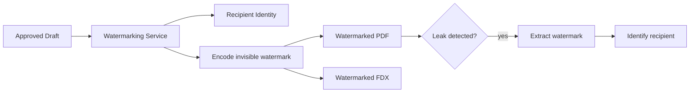

# 11 — Security, Compliance & Accessibility

## Security Posture

| Layer | Control | Implementation |
|-------|---------|---------------|
| Network | mTLS inside service mesh | Istio/Linkerd with auto-rotated certificates |
| Build | Signed builds | Sigstore/cosign for container image verification |
| Deployment | Feature-flag gated rollouts | LaunchDarkly/Unleash for progressive delivery |
| Audit | Detailed audit logs | Every state mutation logged with actor, timestamp, diff |
| Auth | SSO + RBAC | SAML/OIDC for enterprise SSO; SCIM for user provisioning |
| Data | Encryption at rest + in transit | AES-256 at rest; TLS 1.3 in transit |

## Forensic Watermarking



Watermarking is a **delivery-path service**, not a UI convenience. Every exported script carries an invisible watermark encoding:
- Recipient identity
- Export timestamp
- Project and version identifiers
- Access scope (NDA-bound, internal, public)

## Rights & Legal Control

| Control Area | What Is Tracked | Purpose |
|-------------|----------------|---------|
| Rights tags | Territory, clearance state, approved recipients | Controls which assets can be shared and with whom |
| NDA gates | Acceptance status tied to recipient identity | Prevents unsecured distribution |
| Release tracking | Talent, location, likeness, scene-linked releases | Legal and production readiness |
| Legal hold | Project/version hold flags with reason codes | Preserves artifacts under dispute, audit, or retention |

## AI Compliance

| Requirement | Implementation |
|-------------|---------------|
| WGA AI disclosure | AI Contribution Ledger — every interaction logged with model, output, writer action |
| GDPR/DPDP-aware retention | Configurable retention policies per jurisdiction; right-to-delete |
| SOC 2 readiness | Audit trails, access controls, encryption, incident response |
| ISO 27001 readiness | Information security management system controls |

## Accessibility Commitment (WCAG 2.2 Level AA)

| Requirement | Scope |
|-------------|-------|
| Keyboard-only navigation | Editing, approvals, review workflows |
| Visible focus indicators | Logical focus order throughout |
| Screen-reader semantics | Script structure, revision markers, figures |
| Reduced-motion support | Collaboration cursors, timeline interactions |
| Captions and transcripts | Recorded table reads, review sessions |
| Color-contrast defaults | All interface surfaces |

## Audit Trail Schema

```typescript
interface AuditEntry {
  id: string;
  timestamp: string;
  actor_id: string;
  actor_type: 'user' | 'service' | 'system';
  action: string;                    // "script.publish", "take.log", "ai.suggest"
  resource_type: string;             // "script", "scene", "breakdown", etc.
  resource_id: string;
  project_id: string;
  diff: Record<string, any> | null;  // before/after for mutations
  ip_address: string | null;
  user_agent: string | null;
  metadata: Record<string, any>;
}
```

## Decisions

**Watermarking — build in-house using steganographic techniques; Digimarc for enterprise litigation cases. See ADR-025.**
In-house approach: character spacing micro-adjustments in PDF (imperceptible to readers, survives print and scan), and Unicode zero-width character injection in FDX (survives copy-paste, encodes recipient ID in binary). Both techniques encode: recipient UUID, export timestamp, project ID, version ID, and access scope. Sufficient for identifying leaks. Digimarc provides legally certified provenance suitable for litigation — offered as a premium add-on for major studio clients (who will pay the licensing cost). Building in-house first avoids a hard external dependency and significant licensing cost for all tiers.

**SOC 2 Type II timeline — begin prep at Week 20 (Beta milestone); target report by Week 44.**
SOC 2 Type II requires a minimum 6-month observation period. Starting at Week 20 aligns the 6-month window with GA (Week 36) plus 8 weeks post-launch, delivering the report at approximately Week 44. Starting earlier wastes audit spend on a product still changing rapidly (pre-Beta controls are immature). Starting later delays enterprise sales where SOC 2 is a procurement requirement.

**GDPR / data residency — EU-only region for EU clients (not multi-region active-active).**
GDPR requires EU personal data to remain in the EU — it does not require multi-region. A single EU Kubernetes cluster (europe-west4 on GCP, or eu-west-1 on AWS) with Multi-AZ redundancy satisfies GDPR and is far simpler to operate than active-active multi-region. EU clients are provisioned on the EU cluster at signup. US clients on the US cluster. Cross-region data transfer is prohibited. Full active-active multi-region is a v2 scaling concern, not a compliance requirement.

**Accessibility testing — axe-core in CI (blocking), Lighthouse scheduled (non-blocking), manual screen reader quarterly.**
axe-core catches ~57% of WCAG 2.2 AA violations automatically and is fast enough to run in CI as a blocking gate. A PR that introduces axe-core violations fails. Lighthouse performance and accessibility audits run on a nightly schedule (not blocking — performance budgets are informational at this stage). Manual screen reader testing with NVDA (Windows) and VoiceOver (macOS/iOS) is conducted quarterly by QA, covering the script editor, approval workflows, and review surfaces. Automated tools cannot catch reading order issues, complex widget semantics, or screen reader announcement quality.
