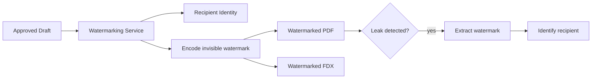

# 11 — Security, Compliance & Accessibility

## Security Posture

| Layer | Control | Implementation |
|-------|---------|---------------|
| Network | mTLS inside service mesh | Istio/Linkerd with auto-rotated certificates |
| Build | Signed builds | Sigstore/cosign for container image verification |
| Deployment | Feature-flag gated rollouts | LaunchDarkly/Unleash for progressive delivery |
| Audit | Detailed audit logs | Every state mutation logged with actor, timestamp, diff |
| Auth | SSO + RBAC | SAML/OIDC for enterprise SSO; SCIM for user provisioning |
| Data | Encryption at rest + in transit | AES-256 at rest; TLS 1.3 in transit |

## Forensic Watermarking



Watermarking is a **delivery-path service**, not a UI convenience. Every exported script carries an invisible watermark encoding:
- Recipient identity
- Export timestamp
- Project and version identifiers
- Access scope (NDA-bound, internal, public)

## Rights & Legal Control

| Control Area | What Is Tracked | Purpose |
|-------------|----------------|---------|
| Rights tags | Territory, clearance state, approved recipients | Controls which assets can be shared and with whom |
| NDA gates | Acceptance status tied to recipient identity | Prevents unsecured distribution |
| Release tracking | Talent, location, likeness, scene-linked releases | Legal and production readiness |
| Legal hold | Project/version hold flags with reason codes | Preserves artifacts under dispute, audit, or retention |

## AI Compliance

| Requirement | Implementation |
|-------------|---------------|
| WGA AI disclosure | AI Contribution Ledger — every interaction logged with model, output, writer action |
| GDPR/DPDP-aware retention | Configurable retention policies per jurisdiction; right-to-delete |
| SOC 2 readiness | Audit trails, access controls, encryption, incident response |
| ISO 27001 readiness | Information security management system controls |

## Accessibility Commitment (WCAG 2.2 Level AA)

| Requirement | Scope |
|-------------|-------|
| Keyboard-only navigation | Editing, approvals, review workflows |
| Visible focus indicators | Logical focus order throughout |
| Screen-reader semantics | Script structure, revision markers, figures |
| Reduced-motion support | Collaboration cursors, timeline interactions |
| Captions and transcripts | Recorded table reads, review sessions |
| Color-contrast defaults | All interface surfaces |

## Audit Trail Schema

```typescript
interface AuditEntry {
  id: string;
  timestamp: string;
  actor_id: string;
  actor_type: 'user' | 'service' | 'system';
  action: string;                    // "script.publish", "take.log", "ai.suggest"
  resource_type: string;             // "script", "scene", "breakdown", etc.
  resource_id: string;
  project_id: string;
  diff: Record<string, any> | null;  // before/after for mutations
  ip_address: string | null;
  user_agent: string | null;
  metadata: Record<string, any>;
}
```

## Open Questions

- [ ] Watermarking technology: build in-house or license (e.g., Digimarc)?
- [ ] SOC 2 Type II timeline: when to begin audit prep?
- [ ] GDPR: data residency requirements for EU clients — multi-region deployment?
- [ ] Accessibility: automated testing tools (axe-core, Lighthouse) in CI/CD?
