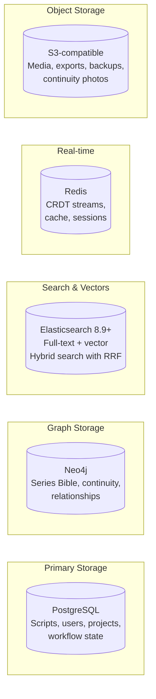
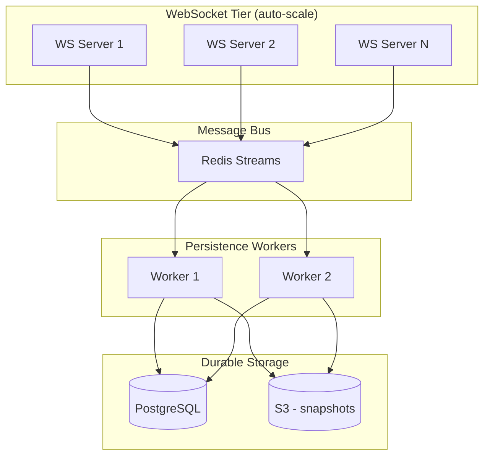
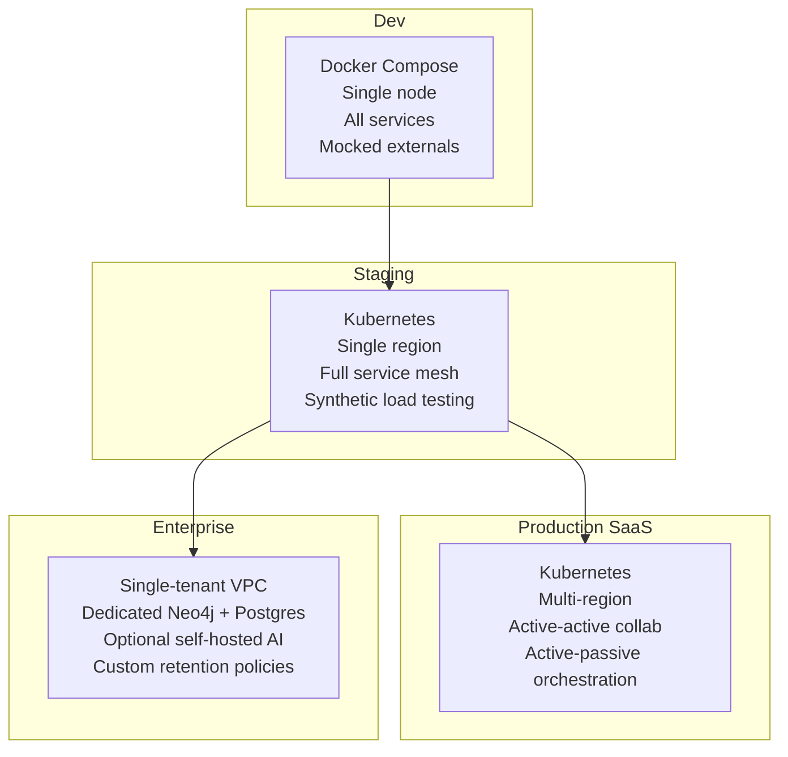

# 12 — Infrastructure & Scaling

## Scale Assumptions

### Document Sizes

| Document Type | Raw Size | With AST Metadata | With CRDT History |
|---------------|----------|-------------------|-------------------|
| 120-page feature screenplay | ~150 KB | 300 KB – 1 MB | 500 KB – 3 MB |
| TV episode (60 min) | ~80 KB | 200 KB – 600 KB | 300 KB – 2 MB |
| Multi-season series bible | — | 5 – 50 MB (graph) | N/A (append-only) |

For reference: Yjs handles 10M+ character documents. A screenplay is trivially small.

### Concurrent Users

| Use Case | Concurrent Editors | Concurrent Viewers | Pattern |
|----------|-------------------|--------------------|---------|
| Writers room | 5–10 | 5–10 | Bursty, session-based |
| Table read | 1–3 | 10–30 | Mostly read |
| Production crew | 5–10 | 50–200 | 5% write, 95% read |

Design target: **10 concurrent editors + 200 concurrent viewers per document**.

## Data Layer Choices

### Why Neo4j for Bible Graph

| Feature | Neo4j | Amazon Neptune | Dgraph | TypeDB |
|---------|-------|---------------|--------|--------|
| Query language | Cypher ✅ | Gremlin/SPARQL | GraphQL± | TypeQL |
| Traversal performance | Excellent | Good | Good | Good |
| Graph analytics (GDS) | PageRank, community detection ✅ | Limited | Limited | Reasoning engine |
| Managed service | Aura (free → enterprise) | AWS-only | Acquired 2x ⚠️ | Self-hosted only |
| Developer ecosystem | Largest | AWS docs | Declining ⚠️ | Small |
| Visualization | Neo4j Browser, Bloom | Neptune Workbench | Ratel | TypeDB Studio |

**Neo4j wins** because Cypher maps naturally to bible traversals ("find all characters who appeared in Season 2 but not Season 3"), GDS enables computing character importance, and Aura provides a managed service from free tier to enterprise.

## CRDT Sync Scaling with y-redis

**Key y-redis behaviors:**
- Server does NOT hold Y.Doc in memory after initial sync
- Streams updates through Redis — extremely memory-efficient
- Unlimited server instances, no coordination needed
- Worker processes persist to durable storage
- **AGPL license — commercial license required**

## Cost Framework by Scale

| Tier | Users | Infrastructure | Monthly Cost |
|------|-------|---------------|-------------|
| **Startup** | Up to 1K | Hocuspocus (single instance), managed Postgres, Neo4j Aura Free, ES starter | **$200–400** |
| **Growth** | 1K–50K | y-redis (2–4 instances), RDS Multi-AZ, Neo4j Aura Pro, 3-node ES | **$2,000–5,000** |
| **Enterprise** | 50K+ | y-redis on K8s (multi-region), Aurora, Neo4j Enterprise, dedicated ES | **$10,000–30,000** |

### Dominant Cost Drivers

| Resource | Cost Factor | Optimization |
|----------|-------------|-------------|
| WebSocket connections | ~50 KB memory each | Auto-scale based on active sessions |
| Redis stream storage | Grows with document activity | TTL on old streams, compaction |
| Object storage (media) | TB-scale for continuity photos | Lifecycle policies, tiered storage |
| AI API calls | Per-token costs | Model routing, prompt caching, semantic caching |
| Graph database | Node/relationship count | Neo4j Aura auto-scales; minimal for typical series |

## Deployment Environments

## Observability Stack

| Component | Tool | Purpose |
|-----------|------|---------|
| Metrics | Prometheus + Grafana | Infrastructure + application metrics |
| Tracing | OpenTelemetry + Jaeger/Tempo | Distributed request tracing |
| Logging | Loki or ELK | Centralized log aggregation |
| Alerting | Grafana Alerting / PagerDuty | Incident notification |
| Service mesh observability | Kiali (with Istio) | Service-to-service traffic visualization |

## Decisions

**y-redis commercial license — budget $2,000–5,000/month at growth scale; use Hocuspocus (MIT) at startup scale.**
y-redis is AGPL — proprietary use requires a commercial license from the y-redis maintainers. At startup scale (< 1K users, single WebSocket instance sufficient), use Hocuspocus instead: it is MIT licensed, single-instance, and eliminates the licensing decision while the platform is pre-revenue. Switch to y-redis when horizontal WebSocket scaling becomes necessary (active session count exceeds one instance's capacity). Budget the commercial license as part of the growth-tier infrastructure spend.

**Multi-region strategy — active-active for CRDT collaboration; active-passive for everything else.**
CRDT collaboration (Redis Streams) uses globally replicated Redis (Upstash Global or Redis Cluster with cross-region replication) — any writer in any region connects to any WebSocket server and their ops reach all peers. Postgres writes go to the primary region only (active-passive); the secondary region reads from a replica. Temporal runs in a single region (workflow consistency requires a single source of truth); Temporal Cloud handles infrastructure failover. This is the strategy with the best latency for the most latency-sensitive use case (real-time editing) without the complexity of multi-master Postgres.

**Object storage — AWS S3 at launch; evaluate Cloudflare R2 if egress costs exceed $500/month.**
S3 is the universal standard with the broadest SDK and tooling ecosystem. Operational familiarity at launch outweighs R2's cost advantage. At TB-scale of continuity photo storage and script export downloads, R2's zero-egress-fee model becomes compelling (S3 charges $0.09/GB egress). Migration from S3 to R2 is mechanical (R2 is S3-compatible API). Set a cost threshold: if monthly egress exceeds $500, evaluate R2 migration. No code changes required — only S3 endpoint configuration changes.

**Kubernetes provider — GKE (Google Kubernetes Engine) with Autopilot mode. See ADR-026.**
GKE Autopilot manages node provisioning, scaling, and security patching automatically, reducing cluster management burden significantly for a small team. Google Cloud provides the best native integration with Cloud SQL (managed Postgres), Artifact Registry (container images), and Cloud Armor (DDoS protection). Kubernetes was created at Google — GKE has the deepest feature set and earliest access to new Kubernetes capabilities. Switch to EKS only if enterprise clients require AWS for compliance or procurement reasons (offered as an enterprise deployment option, not the default).

**Database migrations — Atlas (ariga.io). See ADR-027.**
Atlas generates migration files from schema declarations (declarative migrations) — engineers declare the target schema state, Atlas computes the diff and generates the SQL migration. This fits the schema-per-service model: each service's schema is declared in its own `schema.hcl` file. Atlas handles multi-schema drift detection (flags when a running database diverges from its declared schema). Flyway is mature but requires hand-writing SQL migrations, creating room for errors across 13 schemas. Liquibase is similar to Flyway. Atlas's declarative approach is meaningfully safer at this schema count.
