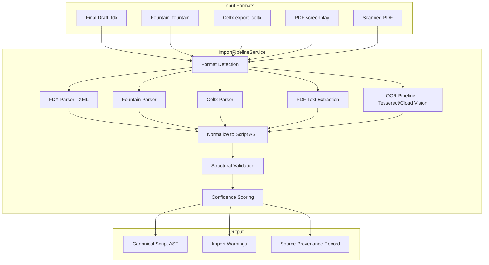

# 13 — Import & Migration Pipeline

## Why This Is P0

Migration is a launch blocker. Writers and production teams have existing projects in Final Draft, Fountain, Celtx, and legacy PDFs. If they can't bring their work into ScriptOS without friction, adoption stalls regardless of feature quality.

## Import Pipeline Architecture



## Format-Specific Parsing

### Final Draft FDX

FDX is XML with well-defined element types. Highest fidelity import.

| FDX Element | Maps To |
|-------------|---------|
| `<Paragraph Type="Scene Heading">` | `scene_heading` node |
| `<Paragraph Type="Action">` | `action` node |
| `<Paragraph Type="Character">` | `character_name` node |
| `<Paragraph Type="Dialogue">` | `dialogue` node |
| `<Paragraph Type="Parenthetical">` | `parenthetical` node |
| `<Paragraph Type="Transition">` | `transition` node |
| `<SceneProperties>` | Scene metadata |
| `<HeaderAndFooter>` | Revision info |

### Fountain

Plain text format with convention-based parsing. Well-documented spec.

Key parsing rules:
- Scene headings: lines starting with `INT.`, `EXT.`, `INT./EXT.`, `.` (forced)
- Characters: lines in ALL CAPS followed by dialogue
- Parentheticals: lines in `(parentheses)` between character and dialogue
- Transitions: lines ending in `TO:` or starting with `>`
- Dual dialogue: `^` after character name

### PDF (Digital)

Extract text with pdftotext/PyMuPDF, then apply positional heuristics:
- Left margin position determines element type
- Character names: centered, ALL CAPS
- Dialogue: centered, mixed case
- Action: full width
- Scene headings: left-aligned, starts with INT./EXT.

### PDF (Scanned / OCR)

Pipeline: rasterize pages → OCR (Tesseract or Cloud Vision) → same positional heuristics as digital PDF.

Additional challenges: noise, font variations, handwritten annotations. Confidence scoring is critical.

## Confidence Scoring

Every imported element gets a confidence score:

| Score | Meaning | UI Treatment |
|-------|---------|-------------|
| 0.95–1.0 | High confidence | Auto-accepted, no flag |
| 0.75–0.95 | Moderate confidence | Yellow warning, auto-accepted with flag |
| 0.50–0.75 | Low confidence | Orange warning, requires manual review |
| Below 0.50 | Very low confidence | Red warning, element marked for correction |

Common low-confidence scenarios:
- Ambiguous element type (is this action or a scene heading?)
- Character name that's also a common word
- Dual dialogue detection
- Page break mid-element
- OCR artifacts

## Migration Phases

| Phase | Strategy | User Experience |
|-------|----------|----------------|
| **Phase A: Parity migration** | Import, render, export without altering workflows | "My script looks the same in ScriptOS" |
| **Phase B: Dual-run** | Use ScriptOS for breakdown/planning, keep legacy for writing | "I plan in ScriptOS, write in Final Draft" |
| **Phase C: System-of-record** | New drafts originate in ScriptOS; legacy consumes exports | "ScriptOS is my primary tool" |

## Export Formats

ScriptOS must also **export** to ensure interoperability:

| Format | Purpose | Fidelity |
|--------|---------|----------|
| FDX | Final Draft interop | High — round-trip compatible |
| Fountain | Open format sharing | High — text-based, no loss |
| PDF | Distribution, watermarked | High — rendered from AST |
| OTIO | Editorial handoff | Structural only |
| JSON | API consumers | Full AST with metadata |

## Source Provenance

Every imported script retains a provenance record:

```typescript
interface ImportProvenance {
  id: string;
  source_format: 'fdx' | 'fountain' | 'celtx' | 'pdf' | 'pdf_ocr';
  source_filename: string;
  source_hash: string;              // SHA-256 of original file
  imported_at: string;
  imported_by: string;
  parser_version: string;
  overall_confidence: number;
  element_warnings: ImportWarning[];
  original_file_ref: string;        // S3 path to archived original
}
```

## Decisions

**Celtx support — PDF export path only; no native Celtx format parsing.**
Celtx does not publish a format specification. Reverse-engineering a proprietary/undocumented format is a maintenance liability — any Celtx version update can break the parser with no warning. Celtx supports PDF export, which our PDF parser already handles. Users migrating from Celtx use `File → Export → PDF` in Celtx, then import the PDF into ScriptOS. Document this migration path clearly in onboarding.

**OCR accuracy threshold — flag at 85% confidence; block auto-import below 60%.**
Maps to the confidence tiers in the import table: 85–100% = auto-accepted (high/moderate confidence), 60–85% = flagged for review (orange warning), below 60% = blocked, requires manual correction before proceeding. These thresholds match common document OCR pipeline practices. The 60% block threshold prevents garbage data from entering the AST. Below 60%, the element count and type distribution are likely wrong enough to produce a misleading import. Thresholds are configurable per-org for productions with consistently clean scan quality.

**Round-trip fidelity testing — automated in CI, mandatory for parser and export changes.**
Test library of 20 reference scripts: 10 public domain (classic screenplays in FDX and Fountain), 10 synthetic (generated to cover edge cases — dual dialogue, transitions, scene number suffixes, OCR artifacts, missing slug lines). CI pipeline: import reference FDX → export to FDX → import again → assert AST structural equality (same node count, same scene sequence, same character names, same dialogue content). For PDF: assert structural equivalence within edit distance threshold for text content. Any PR touching the import pipeline or export formatters must pass all 20 round-trip tests.

**Batch import — yes, support season-level batch import at launch.**
Showrunners migrating to ScriptOS have an entire season already written. Requiring episode-by-episode import is a usability blocker for adoption. Batch import accepts: a zip file of FDX/Fountain files, or a folder upload. Each file becomes an episode. Episode numbering is inferred from filenames (e.g., `S01E03_title.fdx`) and confirmed by the user in a review step before the import saga begins. The import saga processes episodes in parallel (separate Temporal activities per episode).

**Revision history from FDX — preserve color and date metadata; do not reconstruct page-level history.**
FDX stores the current revision color and date on the document and on individual elements (`RevisionChange` attribute). ScriptOS preserves these: the imported script's `revision_color` is set from the FDX document-level revision metadata, and individual AST nodes inherit the `revision_color` from their FDX `RevisionChange` attribute where present. What we do NOT attempt: reconstructing the full revision history (which pages changed between which revisions) from a single FDX file. That history requires the intermediate revision files, which typically are not provided. The import is honest — it captures the current state, not the journey to it.
