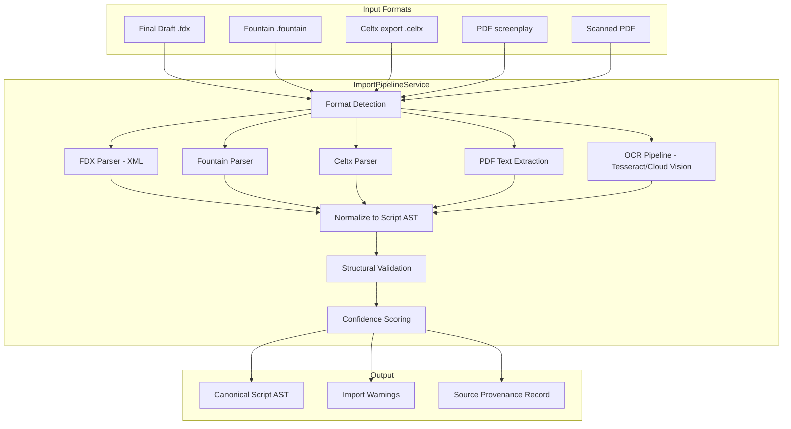

# 13 — Import & Migration Pipeline

## Why This Is P0

Migration is a launch blocker. Writers and production teams have existing projects in Final Draft, Fountain, Celtx, and legacy PDFs. If they can't bring their work into ScriptOS without friction, adoption stalls regardless of feature quality.

## Import Pipeline Architecture



## Format-Specific Parsing

### Final Draft FDX

FDX is XML with well-defined element types. Highest fidelity import.

| FDX Element | Maps To |
|-------------|---------|
| `<Paragraph Type="Scene Heading">` | `scene_heading` node |
| `<Paragraph Type="Action">` | `action` node |
| `<Paragraph Type="Character">` | `character_name` node |
| `<Paragraph Type="Dialogue">` | `dialogue` node |
| `<Paragraph Type="Parenthetical">` | `parenthetical` node |
| `<Paragraph Type="Transition">` | `transition` node |
| `<SceneProperties>` | Scene metadata |
| `<HeaderAndFooter>` | Revision info |

### Fountain

Plain text format with convention-based parsing. Well-documented spec.

Key parsing rules:
- Scene headings: lines starting with `INT.`, `EXT.`, `INT./EXT.`, `.` (forced)
- Characters: lines in ALL CAPS followed by dialogue
- Parentheticals: lines in `(parentheses)` between character and dialogue
- Transitions: lines ending in `TO:` or starting with `>`
- Dual dialogue: `^` after character name

### PDF (Digital)

Extract text with pdftotext/PyMuPDF, then apply positional heuristics:
- Left margin position determines element type
- Character names: centered, ALL CAPS
- Dialogue: centered, mixed case
- Action: full width
- Scene headings: left-aligned, starts with INT./EXT.

### PDF (Scanned / OCR)

Pipeline: rasterize pages → OCR (Tesseract or Cloud Vision) → same positional heuristics as digital PDF.

Additional challenges: noise, font variations, handwritten annotations. Confidence scoring is critical.

## Confidence Scoring

Every imported element gets a confidence score:

| Score | Meaning | UI Treatment |
|-------|---------|-------------|
| 0.95–1.0 | High confidence | Auto-accepted, no flag |
| 0.75–0.95 | Moderate confidence | Yellow warning, auto-accepted with flag |
| 0.50–0.75 | Low confidence | Orange warning, requires manual review |
| Below 0.50 | Very low confidence | Red warning, element marked for correction |

Common low-confidence scenarios:
- Ambiguous element type (is this action or a scene heading?)
- Character name that's also a common word
- Dual dialogue detection
- Page break mid-element
- OCR artifacts

## Migration Phases

| Phase | Strategy | User Experience |
|-------|----------|----------------|
| **Phase A: Parity migration** | Import, render, export without altering workflows | "My script looks the same in ScriptOS" |
| **Phase B: Dual-run** | Use ScriptOS for breakdown/planning, keep legacy for writing | "I plan in ScriptOS, write in Final Draft" |
| **Phase C: System-of-record** | New drafts originate in ScriptOS; legacy consumes exports | "ScriptOS is my primary tool" |

## Export Formats

ScriptOS must also **export** to ensure interoperability:

| Format | Purpose | Fidelity |
|--------|---------|----------|
| FDX | Final Draft interop | High — round-trip compatible |
| Fountain | Open format sharing | High — text-based, no loss |
| PDF | Distribution, watermarked | High — rendered from AST |
| OTIO | Editorial handoff | Structural only |
| JSON | API consumers | Full AST with metadata |

## Source Provenance

Every imported script retains a provenance record:

```typescript
interface ImportProvenance {
  id: string;
  source_format: 'fdx' | 'fountain' | 'celtx' | 'pdf' | 'pdf_ocr';
  source_filename: string;
  source_hash: string;              // SHA-256 of original file
  imported_at: string;
  imported_by: string;
  parser_version: string;
  overall_confidence: number;
  element_warnings: ImportWarning[];
  original_file_ref: string;        // S3 path to archived original
}
```

## Open Questions

- [ ] Celtx export format: which version(s) to support?
- [ ] OCR accuracy threshold: what's the minimum acceptable for production use?
- [ ] Round-trip fidelity testing: automated tests comparing import → export → import?
- [ ] Batch import: support importing entire season (multiple FDX files) at once?
- [ ] Revision history preservation: can FDX revision data map to ScriptOS revisions?
