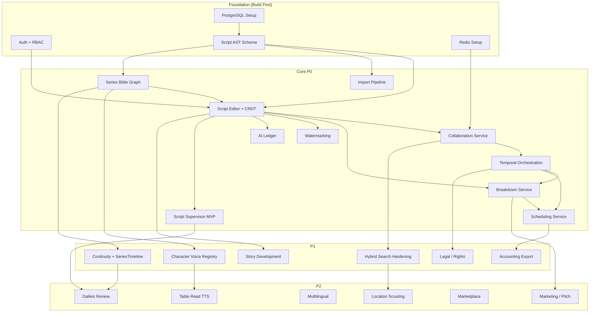

# 15 — Implementation Roadmap

## Service Priority (from Blueprint)

| Priority | Services / Modules | Why Now |
|----------|-------------------|---------|
| **P0** | Script AST, Collaboration, Series Bible, Breakdown, Scheduling, Workflow Orchestrator, Watermarking, AI Ledger, ImportPipeline, Script Supervisor MVP | Core differentiation, migration, compliance |
| **P1** | Story Development, Character Voice Registry, Continuity + SeriesTimeline, Legal/Rights, Accounting Export, Hybrid Search hardening | Writers' room adoption blockers, enterprise buyers |
| **P2** | Location scouting, Table Read TTS, Multilingual workflows, Marketing/Pitch generation, Marketplace, Dailies review player, Frame.io/Evercast connector | Adjacent monetizable workflows |

## Dependency Graph

## Recommended Engineering Sequence

### Phase 0: Foundation (Weeks 1–3)

| Task | Owner | Deliverable |
|------|-------|-------------|
| Project scaffolding | Platform | Monorepo, CI/CD, Docker Compose dev env |
| Auth service | Platform | OIDC/SAML, RBAC, JWT |
| PostgreSQL schema v1 | Backend | Users, projects, permissions tables |
| Redis setup | Platform | Streams config for CRDT sync |
| Neo4j setup | Backend | Aura instance, initial schema |

### Phase 1: Script Editor Core (Weeks 3–8)

| Task | Owner | Deliverable |
|------|-------|-------------|
| Script AST schema finalization | Backend + Product | Canonical node types, metadata fields |
| ProseMirror editor with screenplay formatting | Frontend | Auto-formatting, element type switching |
| Loro/Yjs POC | Backend | CRDT binding evaluation, decision gate |
| CRDT collaboration (text) | Backend + Frontend | Real-time co-editing, presence |
| Import pipeline (FDX + Fountain) | Backend | Parse → AST → persist |
| Export (PDF + FDX) | Backend | AST → formatted output |

### Phase 2: Bible + Breakdown (Weeks 8–14)

| Task | Owner | Deliverable |
|------|-------|-------------|
| Series Bible Graph schema | Backend | Neo4j node/relationship types |
| Bible UI (entities, facts, rules) | Frontend | CRUD for characters, locations, lore |
| Bible ↔ Script linking | Backend | Character/location references in scenes |
| Breakdown auto-detection | Backend | NLP-based element tagging from AST |
| Breakdown UI | Frontend | Tag management, category views |
| Conflict detection (bible) | Backend | Contradiction alerts on new facts |

### Phase 3: Orchestration + Scheduling (Weeks 14–20)

| Task | Owner | Deliverable |
|------|-------|-------------|
| Temporal deployment | Platform | Temporal Cloud or self-hosted |
| Publish-to-production saga | Backend | Draft lock → validate → breakdown → schedule → approve → lock |
| Scheduling service | Backend | Stripboard, day-out-of-days |
| Scheduling UI | Frontend | Drag-and-drop stripboard, calendar view |
| Revision tracking | Backend + Frontend | Color-coded revisions, diff view |
| Call sheet generation | Backend | Template-based generation from schedule |

### Phase 4: On-Set + AI (Weeks 20–28)

| Task | Owner | Deliverable |
|------|-------|-------------|
| Script Supervisor module | Full-stack | Take logging, deviations, continuity photos |
| Offline sync (PowerSync) | Backend + Mobile | SQLite ↔ Postgres sync |
| Tauri client | Frontend | Native on-set app |
| AI governance layer | Backend | Ledger, consent tracking, model router |
| AI assistance features | Backend + Frontend | Dialogue suggestions, consistency checks |
| Character Voice Registry | Backend + Frontend | Voice profiles, few-shot reference scenes |
| Watermarking service | Backend | Invisible watermark encoding in exports |

### Phase 5: Post-Production + Hardening (Weeks 28–36)

| Task | Owner | Deliverable |
|------|-------|-------------|
| OTIO export + correlation DB | Backend | Editorial export pipeline |
| Editorial re-import + diff | Backend | Change detection and approval workflow |
| Continuity + SeriesTimeline | Backend | Cross-episode continuity graph |
| Legal/Rights service | Backend | NDA gates, rights tags, legal hold |
| Accounting export | Backend | Budget → EP Budgeting / Excel mapping |
| Hybrid search hardening | Backend | Elasticsearch tuning, embedding pipeline |
| Story development UI | Frontend | Beat boards, index cards, arc mapping |
| Accessibility audit | QA | WCAG 2.2 AA compliance |
| Security audit | Security | Penetration testing, SOC 2 prep |

## Key Milestones

| Milestone | Target | Success Criteria |
|-----------|--------|-----------------|
| Internal dogfood | Week 8 | Team writes scripts in ScriptOS daily |
| Alpha (writers) | Week 14 | 10 external writers using editor + bible |
| Beta (production teams) | Week 24 | 3 production teams using breakdown + scheduling |
| GA | Week 36 | Full platform available |

## Decisions

**Team size assumption — 8–12 engineers: 5–7 backend, 2–3 frontend, 1 DevOps/Platform, 1 ML/AI.**
Phase timelines in this roadmap assume this composition. A smaller team extends each phase by 50–100%. A larger team compresses it, but with diminishing returns past ~15 engineers given coordination overhead at this stage. Revisit phase durations if the actual team composition differs significantly.

**Client-committed milestones — none until Alpha (Week 14).**
Committing to external deadlines before the data model and system design are locked is premature. The first external commitment is the Alpha milestone (Week 14) delivered to 10 hand-selected writers. All earlier milestones are internal. After Alpha, Beta (Week 24) may be committed to 3 pilot production companies pending Alpha learnings.

**Scheduling solver — Google OR-Tools. See ADR-021 (wiki/08).**
Already resolved. OR-Tools is the constraint solver; the Scheduling Service wraps it. The 1st AD's manual overrides are always available.

**Launch strategy — phased rollout by persona, not big-bang.**
Persona sequence: (1) Writers — editor + bible (Weeks 8–14), (2) Production teams — breakdown + scheduling + budgeting (Weeks 14–24), (3) On-set — Script Supervisor module (Weeks 24–32). Each persona phase has a distinct user group, limiting the blast radius of early bugs. Big-bang launch requires all modules to be production-ready simultaneously — high risk for a platform this broad. Phased rollout also generates the user feedback that calibrates the remaining roadmap before the next cohort onboards.
